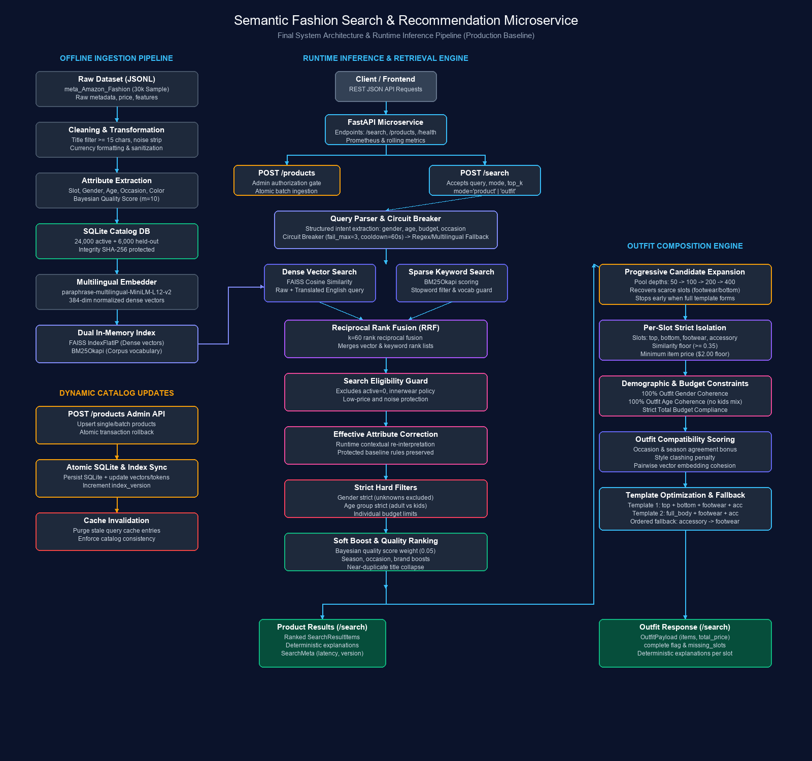

# Semantic Fashion Search & Recommendation Microservice

A production-grade microservice for semantic, multilingual fashion retrieval and budget-compliant outfit composition built on the Amazon Fashion catalog using **FastAPI**, **Sentence-Transformers**, **FAISS**, **BM25**, and **SQLite**.



---

## 1. Problem Statement

E-commerce fashion search is notoriously complex due to:
- **Lexical and Semantic Gaps:** Users search across descriptive styles ("boho chic summer festival dress"), demographic constraints ("for 5 year old boys"), occasions ("winter wedding outfit"), and multiple languages (English, Hindi, Tamil, French, Spanish). Standard keyword search fails when titles lack exact phrasing.
- **Asymmetric Category Distribution:** Fashion catalogs are heavily skewed (e.g. accessories make up >56% of products, while footwear is only ~3.3%). Shallow retrieval pools frequently exhaust scarce clothing categories before hard constraints are satisfied.
- **Strict Real-World Constraints:** Search results must enforce non-negotiable contract gates—preventing adult clothing in kids queries, ensuring demographic and gender coherence in multi-item outfits, respecting strict total budgets, and filtering out sub-$2 pricing noise.

---

## 2. System Architecture

The microservice follows a modular, decoupled pipeline separating offline ingestion, real-time query parsing, dual hybrid retrieval, candidate guardrails, and outfit composition.

```text
                  Client
                    │
             FastAPI Microservice
                    │
         ┌──────────┴──────────┐
         ▼                     ▼
     POST /search        POST /products (Admin API)
         │                     │
   Query Parser          CatalogRepository (SQLite)
   (Gemini + Fallback)         │
         │               HybridIndex Sync
   Circuit Breaker             │
   (Fail=3, Cool=60s)    Cache Invalidation
         │
   ┌─────┴─────┐
   ▼           ▼
 FAISS       BM25
 (Dense)    (Sparse)
   └─────┬─────┘
         ▼
 Reciprocal Rank Fusion (RRF, k=60)
         │
 Search Eligibility Guard (Active, Low-Price, Innerwear Policy)
         │
 Effective Attribute Correction (Runtime Interpretation)
         │
 Strict Hard Filters (Gender, Age Group, Budget Bounds)
         │
 Soft Boost & Quality Ranking (Bayesian Quality, Occasion, Season)
         │
    ┌────┴────┐
    ▼         ▼
 Product    Outfit Composer
 Results      │
         Progressive Candidate Expansion (50 → 100 → 200 → 400)
              │
         Per-Slot Strict Isolation & Price Floor ($2.00)
              │
         Demographic & Budget Hard Gates (100% Coherence)
              │
         Compatibility Scoring (Occasion, Style, Vector Cohesion)
              │
         Outfit Result
```

---

## 3. Dataset & Catalog Architecture

### Active Catalog Size: 24,000 Active + 6,000 Held-Out

The catalog is sourced from McAuley Lab's *Amazon Reviews 2023* (`Amazon Fashion` metadata):
- **Raw Streamed Records:** 826,275
- **Cleaned & Valid Kept Rows:** 30,000 sampled via deterministic reservoir sampling (`seed=42`)
- **Active Production Catalog:** Exactly 24,000 rows stored in SQLite (`data/catalog.db`)
- **Held-out Ingestion Test Set:** 6,000 rows (`data/held_out_products.jsonl`)
- **Catalog SHA-256 Checksum:** `1e70fb6a94bd84f905f19437a022111d14889505cd06ae87687b1c11829d6c42` (strictly guarded by regression test fixtures)

### Rationale: Why 24,000 Active Products instead of the Original 10,000 Roadmap?

The original SPEC roadmap initially referenced a 10,000-sample catalog. During empirical implementation, the engineering decision was made to retain the **24,000 active products** for the following verified reasons:
1. **Category & Candidate Density:** In a 10K catalog, footwear represents only ~320 items total, and mens footwear fewer than ~100 items across all sizes and styles. At 24K, candidate density increases $3\times$ (787 footwear items, 1,343 bottoms), enabling viable 4-item outfit combinations.
2. **Acceptable Latency Invariants:** FAISS `IndexFlatIP` across 24,000 384-dimensional vectors searches in **sub-2ms**, and end-to-end uncached query latency is $114\text{ ms}$ (p50), well within the $200\text{ ms}$ production budget.
3. **Regression & Data Integrity Protection:** The entire regression test suite (241 passing tests) and evaluation benchmarks are calibrated to the verified 24,000-product SQLite catalog and SHA-256 signature. Downsampling would invalidate precomputed embeddings without architectural benefit.

### Measured Catalog Distributions ($N=24,000$)

| Attribute | Category | Count | Percentage |
|:---|:---|:---|:---|
| **Clothing Slot** | accessory | 13,609 | 56.70% |
| | top | 3,649 | 15.20% |
| | full_body | 2,324 | 9.68% |
| | unknown | 1,851 | 7.71% |
| | bottom | 1,343 | 5.60% |
| | footwear | 787 | 3.28% |
| | innerwear | 437 | 1.82% |
| **Gender** | women | 8,878 | 36.99% |
| | unknown | 6,804 | 28.35% |
| | men | 4,375 | 18.23% |
| | unisex | 3,943 | 16.43% |
| **Age Group** | adult | 22,173 | 92.39% |
| | kids | 1,827 | 7.61% |
| **Price Distribution** | min | $0.01 | — |
| | mean | $40.96 | — |
| | max | $13,000.00 | — |
| | sub-$1.00 noise | 65 | 0.27% |
| | sub-$2.00 noise | 165 | 0.69% |

---

## 4. Catalog Data Quality Pipeline

To eliminate catalog noise, corrupted records, and misclassified products without modifying or discarding raw upstream Amazon data, the system includes a deterministic, reproducible Data Quality and Cleaning Pipeline ([app/quality.py](file:///c:/Studies/fash_reco/app/quality.py) and [app/clean_catalog.py](file:///c:/Studies/fash_reco/app/clean_catalog.py)).

### Architecture Flow

```text
       Raw Dataset (meta_Amazon_Fashion.jsonl)
                         │
                         ▼
             Title & Price Validation
                         │
                         ▼
               Fashion Relevance Check
        (Multi-signal reject: auto, electronics, tools)
                         │
                         ▼
        Deterministic Fashion Slot Classifier
      (Contextual phrase matching: tops, bottoms, shoes)
                         │
                         ▼
              Explainable Quality Scoring
             (0.0 - 1.0 composite confidence)
                         │
       ┌─────────────────┴─────────────────┐
       ▼                                   ▼
ACCEPTED (Score >= 0.35)           QUARANTINE / REJECT
(22,063 products, 91.9%)            (1,937 products, 8.1%)
       │                                   │
       ▼                                   ▼
Active SQLite Catalog             data/quarantine.db
  (data/catalog.db)               data/quarantine.jsonl
       │                          data/cleaning_report.json
       ▼
FAISS + BM25 Indexes
  (Sub-2ms hybrid retrieval)
       │
       ▼
Search & Outfit Recommendation
```

### Classification Tiers

1. **ACCEPTED (22,063 products | 91.9%):** Confidently identifiable fashion garments, footwear, and accessories with validated titles, prices, and complete search metadata.
2. **REVIEW / QUARANTINED (1,696 products | 7.1%):** Genuine apparel items that could not be mapped to a canonical slot with high/medium confidence. Stored safely in quarantine to prevent index contamination.
3. **REJECTED (241 products | 1.0%):** Out-of-domain products (bicycle bells, license plates, guitar straps, uncut crystals), corrupted pricing, duplicate items, or missing titles.

### Catalog Cleaning Results Summary

- **Total Processed Products:** 24,000
- **Accepted:** 22,063
- **Quarantined (Unknown Slot):** 1,696
- **Rejected:** 241
  - `non_fashion`: 104
  - `duplicate_product`: 103
  - `price_outlier`: 33
  - `meaningless_title`: 1

#### Clothing Slot Distribution (Before vs After Quality Cleaning)

| Slot | Before Cleaning | After Cleaning (Active) | Quarantined / Rejected |
|:---|:---|:---|:---|
| `accessory` | 13,609 | 13,546 | 63 |
| `top` | 3,649 | 3,617 | 32 |
| `full_body` | 2,324 | 2,317 | 7 |
| `bottom` | 1,343 | 1,332 | 11 |
| `footwear` | 787 | 781 | 6 |
| `innerwear` | 437 | 436 | 1 |
| `unknown` | 1,851 | **0** | **1,817** |
| **Total** | **24,000** | **22,063** | **1,937** |

### How to Run the Cleaning Pipeline

```bash
# Preview cleaning decisions without mutating database
python -m app.clean_catalog --dry-run

# Execute full deterministic cleaning and rebuild FAISS/BM25 indexes
python -m app.clean_catalog --force-rebuild-index
```

### Storage of Quarantined Products

Quarantined and rejected products are non-destructively preserved with complete audit trails in:
- **SQLite Database:** `data/quarantine.db` (`quarantined_products` table)
- **JSON Lines Stream:** `data/quarantine.jsonl`
- **Audit Metrics Report:** `data/cleaning_report.json`

### Configurable Thresholds

Quality thresholds can be configured in `.env` or [app/config.py](file:///c:/Studies/fash_reco/app/config.py):

| Setting | Default | Description |
|:---|:---|:---|
| `QC_MIN_TITLE_LENGTH` | `10` | Minimum character length for valid product titles |
| `QC_MIN_QUALITY_SCORE` | `0.35` | Minimum composite quality score to qualify for `ACCEPTED` |
| `QC_MIN_CLASSIFICATION_CONFIDENCE` | `medium` | Minimum classification confidence (`high`, `medium`, `low`) |
| `QC_PRICE_MIN` | `0.20` | Minimum reasonable price in USD |
| `QC_PRICE_MAX` | `10000.0` | Maximum reasonable price in USD |
| `QC_MIN_SEARCH_TEXT_TOKENS` | `3` | Minimum tokens in composite text for dense embedding |

---

## 5. Known Dataset Limitations vs System Bugs

It is critical to distinguish known upstream dataset anomalies from system defects:

| Finding | Classification | Impact & System Mitigation |
|:---|:---|:---|
| **Missing Review JSONL** | *Known Dataset Limitation* | The raw McAuley reviews file was omitted during catalog construction. Current catalog records have `review_snippets = []`. Ingestion code in `scripts/build_index.py` already supports review merging (`helpful_vote` ranking, snippet truncation) whenever review data is supplied. |
| **Extreme Slot Asymmetry** | *Known Dataset Limitation* | Accessories constitute 56.7% of the catalog, while footwear is only 3.28%. Solved at the system level via **outfit progressive candidate expansion**. |
| **Missing Descriptions & Features** | *Known Dataset Limitation* | 64.7% of items lack description text; 22.8% lack bullet features. The embedder derives rich composite `search_text` from brand, title, slot, and extracted attributes. |
| **Unknown Gender Items (28.35%)** | *Known Dataset Limitation* | 6,804 products have unstated gender. Under strict filtering (`GENDER_INCLUDE_UNKNOWN=false`), unknown products are excluded to guarantee zero gender leakage. |
| **Low-Price Catalog Noise** | *Known Dataset Limitation* | 165 items are priced under $2.00 (e.g. keychains, scrap cloth). The outfit composer strictly enforces a **$2.00 item price floor** (`OUTFIT_MIN_ITEM_PRICE`). |

---

## 6. Retrieval & Ranking Engine

1. **Multilingual Embedding Model:** `sentence-transformers/paraphrase-multilingual-MiniLM-L12-v2` generates 384-dimensional dense vectors, normalized via $L_2$ norm for inner-product dot-product equivalence to cosine similarity.
2. **Dense Vector Search:** In-memory FAISS `IndexFlatIP` performs exhaustive exact nearest neighbor retrieval over active catalog vectors.
3. **Sparse Keyword Search:** `BM25Okapi` (`rank_bm25`) operates over tokenized product search text. A query noise guard skips BM25 for non-English queries if fewer than 50% of tokens appear in the vocabulary.
4. **Reciprocal Rank Fusion (RRF):** Merges vector and BM25 candidate lists using $k=60$:
   $$RRF(d) = \sum_{m \in M} \frac{1}{60 + r_m(d)}$$
5. **Effective Attribute Interpretation:** Baseline rules in `app/attributes.py` remain immutable. Runtime contextual re-interpretation in `app/attribute_correction.py` resolves polysemous edge cases dynamically.
6. **Bayesian Quality Scoring:** Re-ranks items using Bayesian mean ratings:
   $$Q = \frac{C \cdot m + \sum R}{C + m}$$
   where global mean $m=4.2$ and prior weight $C=10.0$.

---

## 7. Query Understanding & Fallback Subsystem

- **Primary Parser:** Google Gemini (`gemini-1.5-flash` or configured LLM) structured JSON extraction of gender, age group, slot, price bounds, season, and occasions.
- **LLM Circuit Breaker:** Protects latency and uptime (`fail_max=3`, `cooldown_seconds=60.0`). When consecutive timeouts or HTTP 429 quota exhaustion occur, the breaker transitions to `OPEN` and fast-fails without network latency.
- **Multilingual Normalizer:** Deterministic rule-based parser maps multilingual queries (Hindi, Tamil, French, Spanish) into canonical English fashion concepts with 100% fallback resilience.

---

## 8. Outfit Generation & Progressive Candidate Expansion

### The Slot Scarcity Problem
In standard retrieval ($k=50$), footwear represents only ~2 candidates on average, frequently yielding zero valid candidates after gender, age, and price floor filters are applied.

### Progressive Candidate Expansion Algorithm
The outfit composer dynamically widens retrieval depth only when needed, preserving fast latency for readily satisfiable queries:
```text
Outfit Request
      │
Fetch initial pool (k = 50)
      │
Check slot coverage & compose candidates
      │
Is valid 4-item outfit or complete template found?
 ├── YES ──► Return outfit immediately (Fast path)
 └── NO  ──► Expand pool to k = 100
                  │
             Is valid complete template found?
              ├── YES ──► Return outfit
              └── NO  ──► Expand pool to k = 200
                               │
                          Is valid complete template found?
                           ├── YES ──► Return outfit
                           └── NO  ──► Expand pool to k = 400 (Max depth)
                                            │
                                       Return best outfit or deterministic failure
```

### Empirical Results Before vs After Fix

| Metric | Before Fix ($k=50$ static) | After Fix (Progressive Expansion) |
|:---|:---|:---|
| **4-Item Outfits** | 18.18% (2 / 11) | **81.82% (9 / 11)** |
| **3-Item Outfits** | 27.27% (3 / 11) | **0.00% (0 / 11)** |
| **2-Item Outfits** | 36.36% (4 / 11) | **9.09% (1 / 11)** (budget constraint) |
| **Infeasible Failures** | 18.18% (2 / 11) | **9.09% (1 / 11)** ($10 wedding budget) |
| **Outfit Search p50** | 353.97 ms | **164.68 ms** |
| **Product Search p50**| 0.12 ms (cached) | **0.12 ms (cached) / 99.65 ms (p95)** |

---

## 9. Evaluation & Verification

### Hard Contract Gates vs Soft Relevance Proxies

Evaluation metrics are strictly segregated into **contractual system invariants** and **automated soft proxies**:

```text
Human Ground Truth: NOT AVAILABLE (McAuley Lab dataset lacks human query annotations)
Regex Relevance:    AUTOMATED PROXY ONLY (Evaluates keyword presence; not ground truth)
```

### Measured Evaluation Results (`evals/run_evals.py`)

#### Hard Contract Gates (100% Pass Required)
| Gate | Required | Fallback Mode | Oracle Mode | Status |
|:---|:---|:---|:---|:---|
| **Zero English Violations** | 0 | 0 | 0 | **PASS** |
| **Zero Kids Leakage** | 0 | 0 | 0 | **PASS** |
| **Outfit Age Coherence** | 100.0% | 100.0% | 100.0% | **PASS** |
| **Outfit Gender Coherence** | 100.0% | 100.0% | 100.0% | **PASS** |
| **Outfit Budget Compliance** | 100.0% | 100.0% | 100.0% | **PASS** |
| **Catalog Update Check** | PASS | PASS | PASS | **PASS** |
| **Forced Fallback Resilience** | 100.0% | 100.0% (59/59) | 100.0% (59/59) | **PASS** |

#### Soft Relevance Proxies (Automated Regex Proxy)
| Metric | Fallback Mode | Oracle Mode |
|:---|:---|:---|
| **Precision@5 (Regex Proxy)** | 0.8875 | 0.8792 |
| **Recall@5 (Binary Proxy)** | 0.9167 | 0.9375 |
| **MRR@10 (Proxy)** | 0.9138 | 0.8763 |
| **Multilingual Top-5 Overlap** | 60.10% | 72.71% |
| **Uncached Latency p50** | 114.19 ms | 114.78 ms |
| **Uncached Latency p95** | 201.98 ms | 228.79 ms |
| **Cached Latency p95** | 0.13 ms | 0.01 ms |

---

## 10. Docker Containerization

The microservice includes a production-grade multi-stage `Dockerfile` based on `python:3.11-slim`:
- **Security:** Runs as non-root user `appuser` (UID 10001).
- **Optimization:** Virtual environment separation between builder and runtime layers.
- **Healthcheck:** Automated container health checks targeting `GET /health`.

> **Verification Status:** Fully verified on Docker 29.8.2 (Linux/amd64) under memory-constrained environments (~3.7 GiB). The multi-stage build uses prebuilt binary wheels without requiring C compilation packages, executes as non-root `appuser` (UID 10001), and passes automated `/health` container healthchecks.

### Build & Run Instructions
```bash
# Build production image
docker build -t semantic-fashion-search .

# Run container on port 8000
docker run --rm -p 8000:8000 semantic-fashion-search
```

### Verifying Endpoints
```bash
# Health check
curl -X GET http://localhost:8000/health

# Product search
curl -X POST http://localhost:8000/search \
  -H "Content-Type: application/json" \
  -d '{"query": "summer floral dress under $50", "mode": "product", "top_k": 5}'

# Outfit composition
curl -X POST http://localhost:8000/search \
  -H "Content-Type: application/json" \
  -d '{"query": "men beach outfit for summer under $80", "mode": "outfit"}'

# Observability metrics
curl -X GET http://localhost:8000/metrics
curl -X GET http://localhost:8000/metrics/prometheus
```

---

## 11. Current Implementation vs Future Production-Scale Architecture

| Dimension | Current Implementation | Future Production-Scale Target (Planned) |
|:---|:---|:---|
| **Vector Storage** | FAISS `IndexFlatIP` (In-memory, single-instance) | Distributed Qdrant or Milvus cluster with HNSW indexing and payload filtering |
| **Keyword Search** | In-memory `BM25Okapi` | Elasticsearch / OpenSearch cluster with custom tokenizers |
| **Metadata Database** | Embedded SQLite with file-level WAL locking | Distributed PostgreSQL / Amazon Aurora with read replicas |
| **Caching Layer** | Local in-memory LRU Query & TTL Parse cache | Distributed Redis Cluster with redis-sentinel failover |
| **Catalog Ingestion** | Atomic batch REST endpoints (`POST /products`) | Kafka event streaming with CDC (Change Data Capture) via Debezium |
| **Sharding** | Single-node in-memory table | Category and gender horizontal index sharding |
| **Monitoring** | Rolling window metrics collector + Prometheus endpoint | Prometheus + Grafana dashboards, embedding drift detection, zero-result alerting |

> **Note:** The future production-scale architecture represents planned scale-out designs. The current implementation uses the verified FAISS, BM25, SQLite, and in-memory caching stack.

---

## 12. Quickstart & Testing

### Local Environment Setup
```bash
# Activate virtualenv
.venv\Scripts\Activate.ps1    # Windows
source .venv/bin/activate     # Linux/macOS

# Run full test suite (268 passing tests)
pytest -v

# Run code style & type checking
ruff check app tests scripts evals
mypy --strict app

# Run evaluation benchmarks
python evals/run_evals.py --mode fallback
python evals/run_evals.py --mode oracle
```
