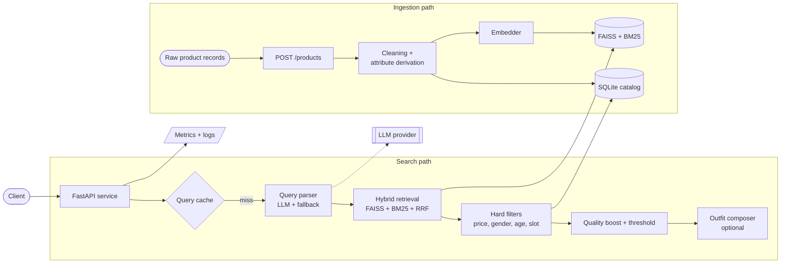
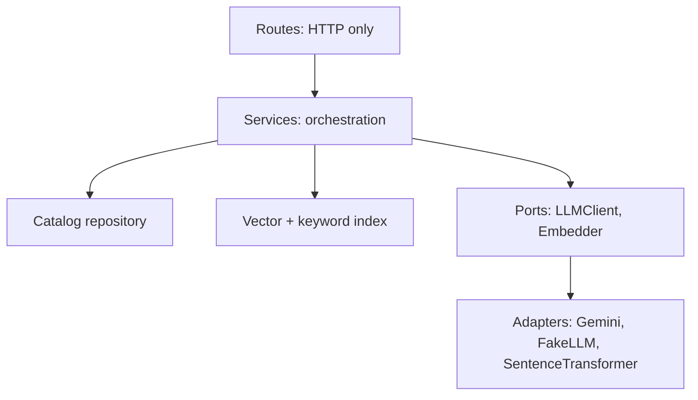
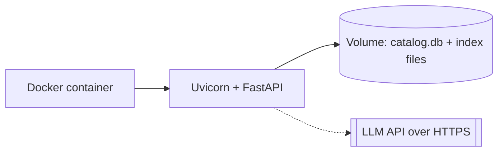

# Architecture

## 1. Overview

The service has two independent paths that share one catalog:

- **Search path**: turns a query into ranked products or an outfit.
- **Ingestion path**: turns raw product records into searchable, versioned catalog entries.

SQLite is the source of truth. FAISS and BM25 are in-memory indexes that can always be rebuilt from it.

## 2. Component diagram

## 3. Components

| Component | Module | Responsibility | Depends on |
|---|---|---|---|
| API layer | `app/main.py` | Routes, validation, error mapping, lifespan | services |
| Config | `app/config.py` | All tunables from environment | none |
| Query parser | `app/parser.py` | Query to `ParsedQuery`, with retry and fallback | `LLMClient` |
| Embedder | `app/embedder.py` | Batch text to normalized vectors | sentence-transformers |
| Index | `app/index.py` | FAISS + BM25, incremental add, RRF fusion | embedder |
| Filters | `app/filters.py` | Pure functions enforcing hard constraints | none |
| Outfit composer | `app/outfit.py` | Slot-wise selection and outfit templates | index, filters |
| Catalog | `app/catalog.py` | SQLite repository, versions, soft delete | sqlite |
| Attributes | `app/attributes.py` | Rule-based gender, age group, slot, colour, season | none |
| Cleaning | `app/cleaning.py` | Text cleaning and `search_text` builder | none |
| Cache | `app/cache.py` | LRU keyed on query, filters, mode, index version | none |
| Metrics | `app/metrics.py` | Counters and latency histograms | none |
| LLM adapters | `app/llm/` | `LLMClient` protocol, real client, fake client | provider SDK |

## 4. Layering rules

- Routes contain no business logic.
- Services depend on interfaces, not concrete clients, so tests inject fakes.
- Ranking, fusion, filtering, and attribute rules are pure functions.

## 5. Technology choices

| Choice | Why | When to move on |
|---|---|---|
| `paraphrase-multilingual-MiniLM-L12-v2` | Small, fast on CPU, covers many languages including Hindi and Tamil | Larger multilingual model if per-language evals show gaps |
| FAISS flat index | Exact search, no tuning, fine at 10k to 100k vectors | HNSW or IVF at 1M+, then a managed vector DB |
| `rank_bm25` | Zero infrastructure, adds exact-term recall | OpenSearch or Elasticsearch when scale or features require it |
| Reciprocal Rank Fusion | No score normalization between vector and BM25 | Learned fusion once click data exists |
| SQLite | Single file, transactional, restart-safe | Postgres when multiple writers or replicas need it |
| In-process LRU cache | Simplest thing that works | Redis for a shared cache across replicas |

## 6. Deployment view (prototype)

A single container with a mounted volume. The scale-out version is described in `production-scale.md`.
