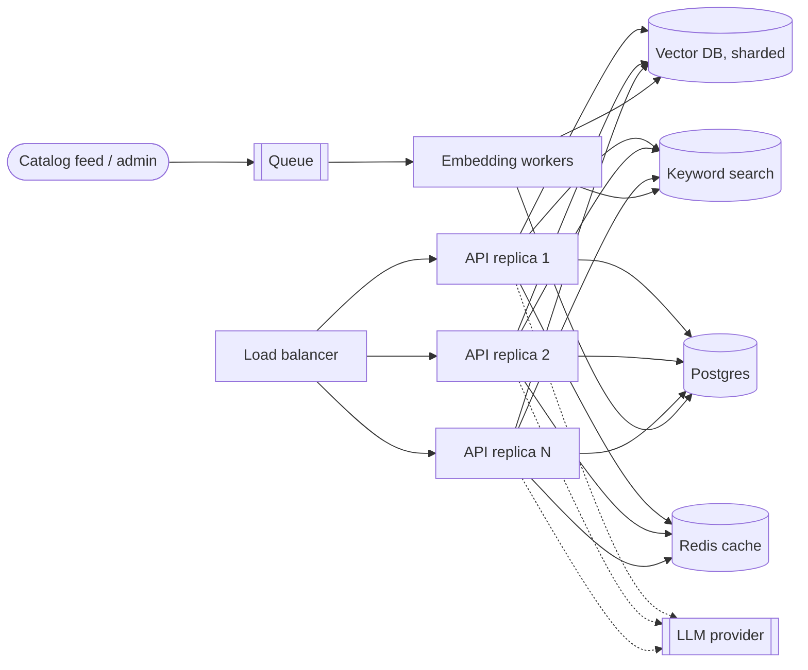

# Production Scale Considerations

The prototype is a single container serving about 10,000 products. This document describes what changes as it grows and why. None of the later stages are built in the prototype; they are the planned path.

## 1. Scaling stages

| Stage | Catalog size | Vector index | Keyword search | Catalog store | Cache |
|---|---|---|---|---|---|
| Prototype | ~10k | FAISS flat (exact) | `rank_bm25` in memory | SQLite | In-process LRU |
| Growth | 100k to 1M | FAISS HNSW or IVF | OpenSearch or Elasticsearch | Postgres | Redis |
| Large | 1M+ | Managed vector DB (for example Qdrant), sharded | OpenSearch cluster | Postgres + read replicas | Redis cluster |

Move up a stage when measured p95 latency, memory use, or ingestion time crosses its budget, not before.

## 2. Target architecture at scale

API replicas are stateless. Writes go through a queue so a catalog import never competes with search traffic.

## 3. Retrieval at scale

- **ANN indexing.** Exact search is fine at 10k vectors. At millions, use HNSW (best recall and latency, more memory) or IVF with product quantization (less memory, more tuning). Choose by measuring recall against exact search on a sample.
- **Sharding.** Shard by category or slot first, since most queries target a slot. Fan out and merge when a query spans slots.
- **Two-stage ranking.** Cheap retrieval returns about 50 to 200 candidates; an optional cross-encoder reranks the top 50 to 10. Add this only if evals show a quality gain worth the latency.
- **Hard filters in the index.** At scale, apply price, gender, and age group as index-level filters so filtering does not shrink the candidate list after retrieval.

## 4. Ingestion and a changing catalog

- Embedding is batched and runs in workers behind a queue. Ingestion is asynchronous at scale; the API returns a job ID.
- Upserts are incremental. A nightly job rebuilds the full index from the source of truth to remove drift and compact deleted entries.
- Soft delete takes effect immediately through a filter; physical removal happens at the nightly rebuild.
- Version rows and bump an index version on each write so caches invalidate without a flush.
- Blue-green index swap for full rebuilds: build the new index alongside the old one, then switch traffic.
- Re-embedding after a model change is a full rebuild, run offline and swapped in.

## 5. Latency and cost

| Lever | Effect |
|---|---|
| Query cache (Redis) | Removes repeat work; key on parsed query so rephrasings can share entries |
| Parse-result cache | Skips the LLM for repeated raw queries |
| Smaller or faster LLM for parsing | Parsing needs structured extraction, not long-form generation |
| LLM timeout (3 s) plus fallback | Bounds worst-case latency |
| Embedding model on GPU or batched inference | Higher throughput for ingestion |
| Precomputed attributes | No LLM at query time for catalog data |

Track LLM spend per 1,000 queries and set a budget alarm.

## 6. Reliability

- Health checks: `/health` reports liveness and readiness (index loaded, catalog reachable, LLM reachable or degraded).
- Graceful degradation is a requirement: the LLM can be down and search still works.
- Rate limiting per client and request size limits at the gateway.
- Timeouts and retries with backoff on every external call; circuit breaker around the LLM.
- Backups of the catalog; indexes are reproducible from it.

## 7. Observability

- Structured JSON logs with a request ID, parsed filters, fallback flag, latency, and result count. No secrets or raw PII in logs.
- Metrics: latency percentiles, fallback rate, zero-result rate, cache hit rate, index size, ingestion lag.
- Alerts: fallback rate, zero-result rate, p95 regression, ingestion backlog.
- Query-drift monitoring: compare recent query topics and zero-result clusters against the catalog's coverage.

## 8. Quality improvement loop

1. Log impressions and clicks (with consent and privacy review).
2. Use clicks to build relevance labels, replacing the keyword proxy.
3. Train or tune a reranker; test with A/B experiments.
4. Evaluate per language and per category, and fix the weakest slice first.

## 9. Security and compliance

- Secrets from environment or a secret manager; never in code or logs.
- Input validation and length limits on all endpoints; protect `POST /products` and `DELETE` with authentication, since they change the catalog.
- Treat product text and reviews as untrusted input when sending them to an LLM (prompt-injection risk); the parser sees only the user query, not catalog text.
- Review dataset licensing before commercial use.

## 10. Future work

Cross-encoder reranking, image embeddings, personalization, `bought_together` signals for outfit pairing, LLM-based attribute tagging at scale, and size and availability filters.
