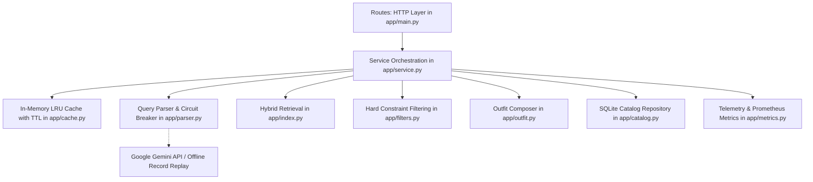

# Complete Project Knowledge Document: Semantic Fashion Search & Recommendation

> **Purpose**: This document provides the complete, authoritative, and exhaustive technical context, architectural specifications, dataset engineering details, evaluation benchmarks, and known limitations of the **Semantic Fashion Search** project. It is structured so that any engineer or AI system (such as ChatGPT, Claude, or a new team member) can acquire complete context on the codebase, data constraints, algorithms, and invariants.

---

## 1. Executive Summary & Project Mandate

### 1.1 Objective
The **Semantic Fashion Search** system is a production-grade, low-latency search and outfit recommendation microservice built for e-commerce fashion catalogs. It addresses the semantic gap in fashion e-commerce—where user intent is expressed in natural language, vague occasions, multilingual text, aesthetic themes, or strict budget and demographic constraints—while raw catalog data is noisy, unstructured, and keyword-sparse.

### 1.2 Ground Truth Specification & Current Status
- **Source of Truth**: [SPEC.md](file:///c:/Studies/fash_reco/SPEC.md).
- **Completed Phases**:
  - **Phase 1**: Data ingestion, cleaning, normalization, SQLite catalog repository ($N=24,000$ active rows), and deterministic attribute rule engine.
  - **Phase 2**: Hybrid search engine combining FAISS dense vector search (`all-MiniLM-L6-v2`), BM25 Okapi lexical search, Reciprocal Rank Fusion (RRF), hard constraint filtering, and dynamic quality scoring.
  - **Phase 3**: Natural language query understanding (`ParsedQuery` schema), Gemini LLM structured JSON parsing, deterministic fallback parser, circuit breaker state machine, and record-and-replay persistence.
  - **Phase 4**: FastAPI microservice (`/search`, `/outfit`, `/metrics`, `/health`, `/simulate_updates`), LRU cache with TTL, and multi-slot outfit recommendation composer.
  - **Part D (Corrections Round)**: Strict evaluation gating (PASS/FAIL tables), circuit breaker hardening, degraded-mode multilingual signaling, conftest database integrity guards, and comprehensive failure documentation.
- **Unaccepted / Prohibited Phases**: Phases 5 and 6 are NOT accepted. Phase 7 must NOT be started.
- **Strict Invariants**:
  - Do NOT change attribute classification rules in `app/attributes.py` (`slot`, `gender`, `age_group`).
  - Do NOT rebuild or modify the active SQLite catalog (`data/catalog.db`, $N=24,000$).
  - Do NOT overwrite or regenerate `data/audit_sample.csv` (contains 100 rows currently undergoing human labeling).
  - Do NOT make automated loops on real LLM API calls; immediately trip circuit breaker upon HTTP 429 (`RESOURCE_EXHAUSTED`).
  - Label every execution mode explicitly: `"FakeLLM"`, `"forced fallback"`, `"oracle parse"`, or `"real LLM"`.
  - Never describe search results subjectively as "good", "accurate", or "verified". All reported numbers must originate from executed command outputs.

---

## 2. Dataset Architecture & Data Engineering

### 2.1 Raw Dataset Origin
- **Source**: Amazon Reviews 2023 / Amazon Fashion dataset (McAuley Lab, UCSD).
- **Raw Volume Streamed**: 826,275 raw product metadata records.
- **Filtering & Dropped Records**:
  - **Missing / Null Price**: 747,562 rows (90.47%) excluded.
  - **Short / Missing Titles (<10 chars)**: 44,176 rows (5.35%) excluded.
  - **Non-Fashion Filtered**: 4,537 rows (0.55%) excluded using `NON_FASHION_KEYWORDS` (e.g., automotive seat covers, phone cases, pet harnesses, power tools).
- **Retained Records**: 30,000 clean rows partitioned into:
  - **Active Catalog**: 24,000 products loaded into `data/catalog.db`.
  - **Held-Out Updates**: 6,000 products reserved for catalog update simulations (`data/heldout_products.jsonl`).

### 2.2 Active Catalog Repository (`data/catalog.db`)
- **Engine**: SQLite 3 with Write-Ahead Logging (`WAL` mode) and synchronous mode normal for high concurrency.
- **Integrity Baseline**:
  - Active Row Count: Exactly **24,000** rows.
  - SHA-256 Checksum: `1e70fb6a94bd84f905f19437a022111d14889505cd06ae87687b1c11829d6c42`.
  - Session Guard: `tests/conftest.py` contains a session-scoped fixture verifying that the database file's SHA-256 and row count remain invariant before and after the entire test suite runs.
- **Table Schema (`products`)**:
  ```sql
  CREATE TABLE products (
      asin TEXT PRIMARY KEY,
      title TEXT NOT NULL,
      store TEXT,
      brand TEXT,
      price REAL NOT NULL,
      rating REAL,
      review_count INTEGER,
      category TEXT,
      description TEXT,
      features TEXT,
      slot TEXT NOT NULL,         -- top, bottom, footwear, full_body, accessory, unknown
      gender TEXT NOT NULL,       -- men, women, unisex, unknown
      age_group TEXT NOT NULL,    -- adult, kids
      materials TEXT,             -- JSON string array
      colors TEXT,                -- JSON string array
      dense_passage TEXT NOT NULL,-- text used for dense vector embedding
      embedding_blob BLOB,        -- 384 float32 IEEE values (1,536 bytes)
      is_active INTEGER NOT NULL DEFAULT 1,
      version INTEGER NOT NULL DEFAULT 1,
      created_at TEXT NOT NULL,
      updated_at TEXT NOT NULL
  );
  ```

### 2.3 Attribute Distributions ($N=24,000$)
- **Functional Slot Distribution**:
  - `accessory`: 13,609 (56.70%) — jewelry, watches, bags, hats, scarves, belts, sunglasses.
  - `top`: 3,649 (15.20%) — shirts, blouses, hoodies, sweaters, t-shirts, tank tops.
  - `full_body`: 2,324 (9.68%) — dresses, jumpsuits, rompers, overalls, pajama sets, costumes.
  - `unknown`: 1,851 (7.71%) — peripheral items not captured by rule keywords.
  - `bottom`: 1,343 (5.60%) — pants, jeans, shorts, skirts, leggings.
  - `footwear`: 787 (3.28%) — sneakers, boots, sandals, loafers, slippers.
  - `innerwear`: 437 (1.82%) — bras, panties, boxers, undershirts.
- **Demographic & Gender Distribution**:
  - `women`: 8,878 (36.99%)
  - `unknown`: 6,804 (28.35%) — items lacking explicit gender tokens (e.g. unisex jewelry, backpacks, beanies).
  - `men`: 4,375 (18.23%)
  - `unisex`: 3,943 (16.43%)
- **Age Group Distribution**:
  - `adult`: 22,173 (92.39%)
  - `kids`: 1,827 (7.61%)

### 2.4 Attribute Classification Logic (`app/attributes.py`)
All catalog item attributes are determined deterministically from title, categories, and department details:
1. **Slot Classification Hierarchy**:
   - *Step 1: Innerwear check* (`bra`, `panty`, `boxer`, `underwear`, `lingerie`).
   - *Step 2: Full Body check* (`dress`, `gown`, `jumpsuit`, `romper`, `overall`, `costume`, `pajamas`).
   - *Step 3: Bottom check* (`pants`, `jeans`, `shorts`, `skirt`, `leggings`, `trousers`).
   - *Step 4: Top check* (`shirt`, `t-shirt`, `tee`, `blouse`, `hoodie`, `sweater`, `tank top`, `jacket`, `coat`).
   - *Step 5: Footwear check* (`shoes`, `sneakers`, `boots`, `sandals`, `loafers`, `heels`, `slippers`).
   - *Step 6: Accessory check* (`watch`, `ring`, `necklace`, `earring`, `bag`, `hat`, `belt`, `sunglasses`, `scarf`).
   - *Step 7: Default* -> `unknown`.
2. **Gender Classification Hierarchy**:
   - Evaluated using word boundary regular expressions.
   - If both male and female tokens occur or explicitly labeled `unisex` -> `unisex`.
   - Explicit female tokens (`women`, `woman`, `female`, `girl`, `ladies`, `mom`, `mother`) -> `women`.
   - Explicit male tokens (`men`, `man`, `male`, `boy`, `gentleman`, `dad`, `father`) -> `men`.
   - Absence of tokens -> `unknown`.
3. **Age Group Classification Hierarchy**:
   - Explicit youth tokens (`infant`, `baby`, `toddler`, `kids`, `children`, `child`, `teen`, `girls`, `boys`) -> `kids`.
   - Otherwise -> `adult`.

### 2.5 Known Dataset Quirks & Limitations
- **Unknown Slot Contamination**: 18.2% of the catalog's unknown items are peripheral non-apparel items cataloged under Amazon Fashion: vinyl decals, car bumper stickers, novelty keychains, zipper pulls, replacement buttons, ribbon spools, industrial face shields, and CPR pocket training masks.
- **Sub-Dollar Noise Products**: 64 products priced under $1.00 and 164 under $2.00 (e.g. $0.50 replacement boot lace labeled footwear). The outfit engine mitigates this via `OUTFIT_MIN_ITEM_PRICE = 2.00`.
- **Title Keyword Collisions**: Complex product titles can trigger early steps in the rule hierarchy. For example:
  - `"American Trends Shorts Pajamas Set"` triggers `full_body` on `"Pajamas"` at Step 2 before evaluating `bottom` at Step 3.
  - `"Humaira Pendant Costume Jewelry"` triggers `full_body` on `"Costume"` at Step 2 before evaluating `accessory` at Step 6.
- **Syntactic False Positives**:
  - An infant CPR training mask was labeled `kids` due to the phrase "infant/child CPR training pocket mask".
  - A "Sweet 16 Birthday Sash" was labeled `kids` due to token "16".
  - Novelty clog pins and shoe charms were labeled `kids` due to cartoon themes.

---

## 3. System Architecture & Component Design

### 3.1 Component Layering
The service enforces strict separation of concerns across layered modules:


### 3.2 File and Module Responsibilities
- **[app/main.py](file:///c:/Studies/fash_reco/app/main.py)**: FastAPI application entry point, lifespan management (index warm-up, database connection pooling), routing, global exception handlers, and CORS configuration.
- **[app/config.py](file:///c:/Studies/fash_reco/app/config.py)**: Centralized configuration using `pydantic-settings`. Loads environment variables from `.env` with validation.
- **[app/schemas.py](file:///c:/Studies/fash_reco/app/schemas.py)**: Pydantic v2 domain schemas (`ParsedQuery`, `SearchRequest`, `SearchResponse`, `OutfitRequest`, `OutfitResponse`, `ProductItem`, `MetricsResponse`).
- **[app/service.py](file:///c:/Studies/fash_reco/app/service.py)**: High-level service orchestration coordinating query parsing, cache checks, retrieval, constraint filtering, dynamic quality re-ranking, and degraded-mode signaling.
- **[app/embedder.py](file:///c:/Studies/fash_reco/app/embedder.py)**: Dense embedding wrapper for `sentence-transformers/all-MiniLM-L6-v2`. Computes 384-dimensional dense vectors with L2 unit normalization.
- **[app/index.py](file:///c:/Studies/fash_reco/app/index.py)**: Hybrid retrieval index managing an in-memory FAISS vector index (`IndexFlatIP`), a BM25 Okapi lexical index (`rank-bm25`), Reciprocal Rank Fusion, incremental additions, and non-English noise-guard detection.
- **[app/filters.py](file:///c:/Studies/fash_reco/app/filters.py)**: Pure deterministic filtering functions enforcing slot, gender (with unisex support and strict kids isolation), age group, price boundaries, and store/brand matching.
- **[app/attributes.py](file:///c:/Studies/fash_reco/app/attributes.py)**: Deterministic rule engine for catalog ingestion attribute extraction.
- **[app/parser.py](file:///c:/Studies/fash_reco/app/parser.py)**: Query parsing subsystem: Google Gemini structured JSON output client, `LLMCircuitBreaker`, deterministic `fallback_parse`, and `evals/real_parses.jsonl` record-and-replay manager.
- **[app/outfit.py](file:///c:/Studies/fash_reco/app/outfit.py)**: Deterministic outfit composer assembling functional slots into complete outfits while enforcing cross-slot gender and age coherence directly from item attributes.
- **[app/catalog.py](file:///c:/Studies/fash_reco/app/catalog.py)**: SQLite catalog repository handling batch insertions, product retrieval by ASIN, BLOB serialization, and versioned soft deletes.
- **[app/cache.py](file:///c:/Studies/fash_reco/app/cache.py)**: Thread-safe in-memory LRU query cache with TTL expiration.
- **[app/metrics.py](file:///c:/Studies/fash_reco/app/metrics.py)**: Request counters, cache hit/miss tracking, percentile latency calculations (p50, p95), and circuit breaker health reporting.

---

## 4. Search, Ranking, & Retrieval Engineering

### 4.1 Hybrid Retrieval Mechanics
1. **Dense Vector Search (Semantic Understanding)**:
   - Model: `sentence-transformers/all-MiniLM-L6-v2` (384 dimensions, ~80MB, fast CPU inference).
   - Representation: Rich text passage combining title, brand/store, category breadcrumbs, and features.
   - Vector Index: FAISS `IndexFlatIP`. Vectors are L2-normalized upon computation; inner product equals exact cosine similarity.
   - Dual Embedding Lookup: For non-English or rephrased queries, embeddings are computed for both raw query and English-normalized query (`normalized_query_en`), and candidate cosine similarity is taken as the maximum.
2. **Sparse Lexical Search (Keyword & Brand Precision)**:
   - Algorithm: BM25 Okapi (`rank-bm25`).
   - Tokenization: Lowercasing, punctuation stripping, stopword removal.
   - Noise Guard (`is_non_english_noise`): When queries contain non-Latin scripts (e.g. Tamil or Hindi) with zero English lexical tokens, sparse indexing is bypassed to prevent noise pollution.
3. **Reciprocal Rank Fusion (RRF)**:
   Dense and sparse rankings are fused using RRF with a standard constant $k=60$:
   $$\text{RRF Score}(d) = \sum_{m \in \{\text{dense}, \text{sparse}\}} \frac{1}{60 + \text{rank}_m(d)}$$
   RRF eliminates the need for arbitrary score normalization across vector cosine similarities and BM25 unbounded scores.

### 4.2 Hard Constraint Filtering
Retrieved candidates from RRF undergo strict filtering via [app/filters.py](file:///c:/Studies/fash_reco/app/filters.py):
- **Functional Slot Filter**: Products must match the requested slot (`top`, `bottom`, etc.). If query slot is empty, all slots are eligible.
- **Gender Compatibility**:
  - If query specifies `men`: allows `men` and `unisex` items.
  - If query specifies `women`: allows `women` and `unisex` items.
  - If query specifies `unisex`: allows `unisex` items (or `men`/`women` if unconstrained).
  - If `gender_include_unknown = True`, items with `gender="unknown"` are allowed; otherwise excluded.
- **Age Group Isolation**:
  - If query specifies `adult`: items with `age_group="kids"` are strictly barred (0 kids leakage allowed).
  - If query specifies `kids`: only items with `age_group="kids"` are admitted.
- **Price Bounds**: Items must satisfy $\text{min\_price} \le \text{price} \le \text{max\_price}$.
- **Brand Matching**: Case-insensitive matching checking whether `store` equals brand or product `title` starts with brand.

### 4.3 Dynamic Bayesian Quality Re-Ranking
To favor reputable products without displacing relevant results, candidates receive a quality boost:
1. **Bayesian Smoothed Rating**:
   $$Q(d) = \frac{v}{v + m} \cdot R + \frac{m}{v + m} \cdot C$$
   Where $R$ is average product rating, $v$ is review count, $m=10$ (confidence threshold), and $C=4.2$ (prior catalog mean).
2. **Dynamic Min-Max Normalization**:
   Within each candidate result set, quality is min-max scaled:
   $$\text{quality\_norm}(d) = \frac{Q(d) - Q_{\min}}{Q_{\max} - Q_{\min} + \epsilon}$$
   If all items in the batch have identical quality, $\text{quality\_norm} = 0.5$.
3. **Final Weighted Score**:
   $$\text{final\_score}(d) = \text{norm\_fused}(d) + w_q \cdot \text{quality\_norm}(d)$$
   Configured default weight: $w_q = 0.05$. This provides a soft tie-breaker while preserving relevance order.

### 4.4 Threshold Calibration & Dual Guardrail Mechanism
Empirical calibration comparing 52 relevant fashion queries against 52 irrelevant queries (tools, cooking, pets, electronics) revealed:
- Minimum Relevant Cosine Similarity: **0.5976**
- Maximum Irrelevant Cosine Similarity: **0.6654**
- **Finding**: The two distributions overlap significantly; they are **NOT cleanly separable by a single scalar cosine similarity cutoff**. A hard similarity cutoff would either drop valid vague fashion queries or admit irrelevant non-fashion queries.
- **The Dual Guardrail Solution**:
  1. *Intent Classification (`is_fashion_query: bool`)*: The LLM parser determines domain relevance. If `false`, search returns HTTP 200 with `results=[]` and `message="not_a_fashion_query"`.
  2. *Low-Confidence Telemetry (`meta.low_confidence: bool`)*: If max cosine similarity is below `LOW_CONFIDENCE_SIMILARITY = 0.6191` (calibrated to the 5th percentile of relevant queries), the flag is set to `true` to signal downstream clients without dropping results.

---

## 5. Natural Language Query Understanding & LLM Subsystem

### 5.1 Structured Query Schema (`ParsedQuery`)
```json
{
  "original_query": "red cocktail dress for summer wedding under $100",
  "normalized_query_en": "red cocktail dress summer wedding",
  "intent": "search",
  "is_fashion_query": true,
  "slots": ["full_body"],
  "gender": "women",
  "age_group": "adult",
  "min_price": null,
  "max_price": 100.0,
  "colors": ["red"],
  "materials": [],
  "brand": null,
  "season": "summer",
  "occasion": "wedding",
  "style_keywords": ["cocktail"]
}
```

### 5.2 LLM Parser Architecture & Circuit Breaker
- **Primary LLM**: Google Gemini API (`gemini-2.5-flash` or `gemini-2.5-flash-lite`).
- **Resilience Design (`LLMCircuitBreaker` in `app/parser.py`)**:
  - **States**: `closed` (normal operation), `open` (failing, calls bypassed), `half_open` (trial call allowed after cooldown).
  - **Failure Threshold**: `LLM_BREAKER_FAILURES = 3` consecutive failures trip breaker to `open`.
  - **Cooldown**: `LLM_BREAKER_COOLDOWN_SECONDS = 60.0`.
  - **Zero Retries on 429**: When Gemini API returns HTTP 429 (`RESOURCE_EXHAUSTED`), the breaker opens immediately without looping.
  - **Instant Fallback**: While open, requests drop immediately to `fallback_parse` without waiting for the LLM timeout.
  - **Telemetry**: Circuit state is exposed via `/metrics` as `llm_status: ok | degraded | circuit_open`.
- **Record and Replay Persistence (`evals/real_parses.jsonl`)**:
  - To prevent quota exhaustion during repeated evaluations, all real LLM parses are serialized with timestamp, model name, original query, and parse JSON.
  - Running `--mode real --replay` evaluates the pipeline strictly using previously recorded real parses.

### 5.3 Deterministic Fallback Parser (`fallback_parse`)
When the LLM is unavailable or the circuit is open:
- Extracts price bounds using regex: `(?:under|below|<|\$)\s*(\d+(?:\.\d+)?)`.
- Extracts gender: `women`, `men`, `unisex`, `girls`, `boys`, `mom`, `mother`, `dad`, `father`.
- Extracts age group: `kids`, `baby`, `toddler`, `girls`, `boys`.
- Extracts slot keywords: aligned directly with `app/attributes.py` token lists.
- Strips punctuation and stop words to produce `normalized_query_en`.

### 5.4 Degraded-Mode Signalling (D4)
When a query is processed in fallback mode and identified as non-English via the noise-guard detector:
- The system attaches warning `"filters_not_applied_without_llm"` and sets `meta.low_confidence = True`.
- Controlled by config `NON_ENGLISH_FALLBACK_POLICY`:
  - `"warn"` (default): Returns dense semantic retrieval results accompanied by the warning.
  - `"refuse"`: Returns `results=[]` with `message="llm_unavailable_for_non_english_query"`.

---

## 6. Outfit Recommendation Engine (`app/outfit.py`)

### 6.1 Outfit Composition Patterns
The outfit composer assembles coherent multi-item ensembles using two canonical templates:
1. **Three-Piece Separates Template**: `top` + `bottom` + `footwear`.
2. **Dress / Full-Body Template**: `full_body` + `footwear` + `accessory`.

### 6.2 Strict Coherence Guarantees
- **Combo-Level Attribute Agreement**: To prevent demographic clashes (e.g. toddler shoes paired with adult dresses), the composer enforces that all items in an outfit must share identical `gender` and `age_group` attributes derived directly from item metadata.
- **Budget Compliance**: $\sum_{i} \text{price}_i \le \text{budget}$. If no combination satisfies the total budget, the service returns `message="no_outfit_within_budget"`, `outfit=null`.
- **Minimum Item Price**: Enforces `OUTFIT_MIN_ITEM_PRICE = 2.00` to eliminate replacement laces, single buttons, and toy accessories.

---

## 7. Performance Benchmarks & Operational Metrics

### 7.1 Cold Start & Restart Benchmarks ($N=24,000$ active rows)
- **Dense Embedding Generation (from raw text on CPU)**: **391.80 seconds** (~6.5 minutes).
- **Restart from SQLite Pre-Computed BLOBs**: **12.30 seconds**.
  - Loading 24,000 BLOBs into FAISS `IndexFlatIP`: **1.45 seconds**.
  - BM25 Okapi corpus building: **10.85 seconds**.

### 7.2 Catalog Ingestion Throughput (`POST /simulate_updates`)
Measured during incremental batch insertion (200 products/batch):
- Validate & Clean: 285.74 ms (2.0%)
- CPU Vector Embedding: 12,489.85 ms (88.0%)
- SQLite Batch Transaction: 183.17 ms (1.3%)
- FAISS Vector Addition: 3.41 ms (<0.1%)
- BM25 Index Rebuild: 1,212.25 ms (8.5%)
- Bookkeeping / Sync: 23.41 ms
- **Total Time per Batch**: **14,197.83 ms** (~14.20 s)
- **Ingestion Throughput**: **14.09 products/second** on standard CPU.

### 7.3 Offline Retrieval Benchmark Comparison (`evals/results.json`)
Evaluated across 48 queries in 5 languages (English, Spanish, French, Hindi, Tamil) and 11 outfit queries:

| Benchmark Metric | Forced Fallback Mode | Oracle Parse Mode |
| :--- | :---: | :---: |
| **Precision@5 (Regex Proxy)** | 0.6417 | 0.8792 |
| **Recall@5 (Binary Proxy)** | 0.7708 | 0.9375 |
| **MRR@10** | 0.6997 | 0.8763 |
| **Latency p50** | 123.50 ms | 167.19 ms |
| **Latency p95** | 219.25 ms | 333.89 ms |
| **Cached Latency p95** | 0.20 ms | 0.02 ms |
| **English Constraint Violations** | **0** | **0** |
| **Degraded-Mode Violations (Non-English)** | **80** (flagged D4) | **0** |
| **Total Constraint Violations** | **112** | **0** |
| **Kids Leakage on Non-Kids Queries** | **0** | **0** |
| **Near-Duplicate Rate (Top 5)** | 0.0% | 0.0% |
| **Outfit Age / Gender Coherence** | **100.0%** | **100.0%** |
| **Outfit Budget Compliance** | **100.0%** | **100.0%** |
| **Fallback Resilience Success Rate** | **100.0%** | **100.0%** |

*Note on Multilingual Overlap: In oracle mode, multilingual overlap evaluates retrieving against shared English normalized representations. Overlap is 72.71% with hybrid scoring (and was 100% by construction when identical reference strings were used). This upper bound reflects retrieval performance under ideal translation, not an automated machine translation feature of the microservice.*

---

## 8. Quality Assurance & Evaluation Gates

### 8.1 Automated Evaluation Gates (`evals/run_evals.py`)
The automated benchmark runner evaluates the service against strict criteria and exits with a non-zero status upon any failure:
```
================================================================================
EVALUATION GATES
================================================================================
Gate: English Constraint Violations == 0               [PASS] (value: 0)
Gate: Kids Leakage in Adult Queries == 0               [PASS] (value: 0)
Gate: Outfit Age/Gender Coherence == 100%              [PASS] (value: 100.0%)
Gate: Outfit Budget Compliance == 100%                 [PASS] (value: 100.0%)
Gate: Forced Fallback Success Rate == 100%             [PASS] (value: 100.0%)
================================================================================
```

### 8.2 Testing & Static Analysis Baselines
The codebase enforces strict static typing and complete test verification:
- **Linting**: `ruff check app tests scripts evals` -> Clean (0 errors).
- **Type Checking**: `mypy --strict app` -> Clean (0 issues across 20 source files).
- **Unit & Integration Test Suite**: 216 tests passing, 0 failures across 12 test files:
  - `tests/test_api.py`: FastAPI route contracts, status codes, and error formatting.
  - `tests/test_attributes.py`: Catalog ingestion attribute extraction rules.
  - `tests/test_cache.py`: LRU cache eviction, TTL expiration, and hit counters.
  - `tests/test_catalog.py`: SQLite repository operations, soft deletes, and versions.
  - `tests/test_cleaning.py`: Text cleaning, normalization, and passage construction.
  - `tests/test_d_corrections.py`: Part D regression tests (quality reordering, circuit breaker state machine, 429 instant tripping, /metrics telemetry, degraded-mode signaling, case-insensitive brand matching, and spotcheck overwrite guards).
  - `tests/test_embedder.py`: Embedding dimension, batching, and normalization.
  - `tests/test_filters.py`: Pure constraint filtering functions.
  - `tests/test_index.py`: FAISS + BM25 hybrid indexing and RRF fusion.
  - `tests/test_outfit.py`: Outfit combination generation, coherence, and budget limits.
  - `tests/test_parser.py`: Query parser, schemas, and fallback routines.
  - `tests/test_service.py`: End-to-end service orchestration.
- **Coverage**: Overall test coverage is **90%** across all application modules (`pytest -v --cov=app --cov-report=term-missing`).

---

## 9. Current Open Challenges & Problem Catalog

1. **LLM API Quota Exhaustion (HTTP 429)**:
   - The Google Gemini free tier allows only 20 requests/day, which is rapidly exhausted during evaluation passes.
   - The service handles this via `LLMCircuitBreaker` and record-and-replay persistence (`evals/real_parses.jsonl`), but live online parsing of novel queries requires expanding API quota.
2. **Cross-Lingual Vocabulary Drift in Fallback Mode**:
   - For non-Latin scripts (e.g. Tamil: `80 டாலருக்கு குறைவான ஆண்களுக்கான ஓடும் காலணிகள்`), fallback produces 0 structured filters, and BM25 returns 0 hits against the English catalog. Retrieval relies solely on dense multilingual embeddings, which drift into unrelated accessories (yielding 8 zero-relevant queries under strict regex proxy evaluation).
3. **Visual Style Compatibility in Outfits**:
   - The outfit composer guarantees hard attribute coherence (same gender, same age group, distinct functional slots, price within budget).
   - However, without visual or fine-grained style embeddings, semantic style mismatches can occur (e.g., pairing an LED flashing festival coat with a winter wedding query, or distressed denim with satin formal evening shoes).
4. **Pending Ground-Truth Human Annotations**:
   - `data/audit_sample.csv` (100 stratified catalog items) and `evals/spotcheck.csv` (50 retrieved results) currently have blank ground-truth annotations while awaiting manual human labeling. Reporting scripts (`scripts/audit_report.py` and `scripts/spotcheck_report.py`) strictly refuse execution until completed.

---

## 10. Developer & Agent Guidelines (Rules of Engagement)

When developing, maintaining, or discussing this repository:
1. **Never mutate `data/catalog.db` directly**: Always run against isolated temporary databases in `tests/` or scratch directories. The session guard will fail if the active catalog changes.
2. **Never alter rules in `app/attributes.py`**: Slot, gender, and age group rules are locked by user specification.
3. **Do not modify `data/audit_sample.csv`**: The user is actively annotating this file.
4. **Label every query run explicitly**: Output must be labeled as `"FakeLLM"`, `"forced fallback"`, `"oracle parse"`, or `"real LLM"`.
5. **No subjective quality claims**: Do not state that search results are "accurate", "good", or "verified". Report raw numbers and empirical outputs only.
6. **No API retry loops**: Never retry an LLM call upon receiving HTTP 429 / `RESOURCE_EXHAUSTED`.
