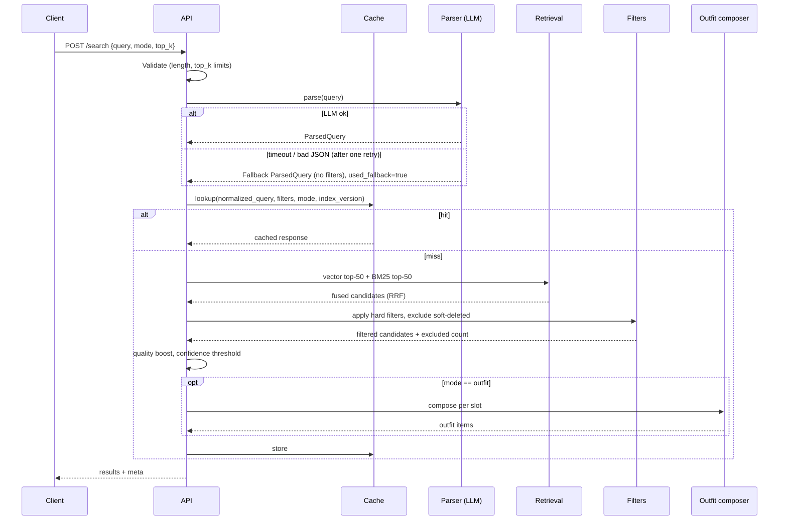
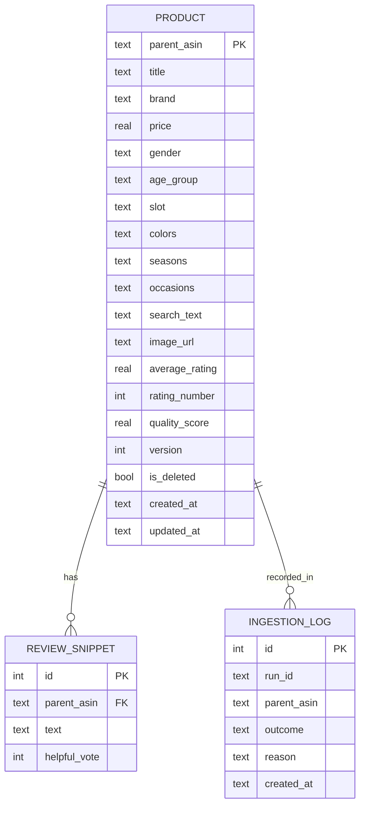
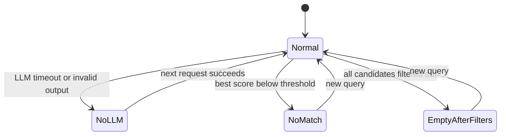

# System Design

## 1. Problem and requirements

**Functional**
1. Accept a natural-language query in any language and return relevant products.
2. Support an outfit mode that returns a complete, coherent set of items.
3. Honor hard constraints (price, gender, age group) with no violations.
4. Accept new and updated products at runtime without a restart.

**Non-functional**
- Availability: `/search` must not fail because the LLM is slow or down.
- Latency: target p95 under 500 ms on a cache miss for a 10k-product catalog (to be verified by evals, not assumed).
- Explainability: each result carries a short reason and the parsed filters used.
- Observability: latency, fallback rate, zero-result rate, and cache hit rate are exposed.

**Out of scope for the prototype:** personalization, image search, payments, user accounts.

## 2. Search request flow



Notes:
- The cache lookup uses the parsed query, so two phrasings that parse the same share an entry.
- The cache key includes `index_version`, so any catalog write invalidates old entries.
- Filters run before truncating to `top_k` so results do not run short.

## 3. Ingestion flow

```mermaid
sequenceDiagram
    participant S as Source (batch script or API caller)
    participant V as Validator
    participant T as Cleaning + attributes
    participant E as Embedder
    participant D as SQLite
    participant I as FAISS + BM25

    S->>V: raw records
    V-->>S: per-record rejections (missing title, null price)
    V->>T: valid records
    T->>T: clean text, derive gender, age group, slot, colour, season
    T->>E: search_text batch
    E-->>T: vectors
    T->>D: BEGIN; upsert rows, version += 1
    T->>I: add / replace vectors and BM25 docs
    alt all steps succeed
        D-->>T: COMMIT
        T->>T: index_version += 1 (invalidates cache)
    else any step fails
        D-->>T: ROLLBACK
        T-->>S: error with reason
    end
```

The batch script and `POST /products` call the same pipeline, so the two paths cannot drift apart.

## 4. Data model



## 5. Degradation behavior



| Condition | Behavior |
|---|---|
| LLM timeout, error, or invalid JSON | Retry once, then search with the raw query and no filters. `used_fallback = true`. |
| Best result below the similarity threshold | Return an empty list, `message: "no_good_match"`, and three suggested queries. |
| Filters remove every candidate | Return an empty list and report `excluded_by_filters` so the cause is visible. |
| Outfit slot has no good item | Omit the slot. Never pad with an irrelevant item. |
| Index write fails during ingestion | Roll back SQLite, leave indexes unchanged, return an error. |
| Process restarts | Rebuild FAISS and BM25 from SQLite on startup. |

## 6. Key design decisions and trade-offs

### 6.1 Hard filters versus soft ranking
Price, gender, and age group are filters because a wrong value is a visible failure (a $45 item under a $30 budget, a girls' dress for a women's query). Season, occasion, and colour are boosts because the data for them is inferred and imperfect.

### 6.2 Unpriced products
In the sample data about 3 of 5 products had no price. A strict price filter cannot make a promise about a product with unknown price. Default: index only priced products and report how many were dropped. A config flag allows including them, at the cost of the guarantee. This is a deliberate trade of catalog coverage for correctness.

### 6.3 Derived attributes at ingestion
Categories are empty in the sample, so slot cannot come from them. Deriving slot, gender, colour, and season once at ingestion keeps the query path fast and deterministic and makes the rules unit-testable. Rules run first; an LLM tagger is an optional improvement for products left `unknown`.

### 6.4 Description beats title for some products
A title such as "Mento Streamtail" says nothing about the product. Its description mentions a thong sandal for the beach. Search text therefore combines the title, brand, derived type, features, a trimmed description, and review snippets.

### 6.5 Kids versus adults
Kids' items share the catalog with adult items. Without an `age_group` filter, an adult query can return a children's dress. Default is adult unless the query indicates otherwise.

### 6.6 Rating handling
Raw average ratings overrate products with few reviews. A Bayesian average pulls low-count items toward the global mean. It is used only as a small ranking boost, never as a filter.

### 6.7 Outfit templates
An outfit is `full_body + footwear + accessory` or `top + bottom + footwear + accessory`. Both are built; the higher-scoring one is returned. This avoids pairing a dress with trousers.

## 7. Risks and mitigations

| Risk | Mitigation |
|---|---|
| Slot rules misclassify (for example "dress shirt") | Ordered rules with explicit exceptions and unit tests |
| LLM extracts wrong constraints | Pydantic validation; filters are echoed in `meta.parsed_filters` for inspection; eval measures parser accuracy |
| Embeddings weak for a language | Per-language consistency eval; fall back to BM25 on the English-normalized query |
| Index and database diverge | SQLite is the source of truth; rebuild on start; ingestion is transactional |
| Evaluation relies on a keyword proxy | Documented limitation plus a manual spot-check |
