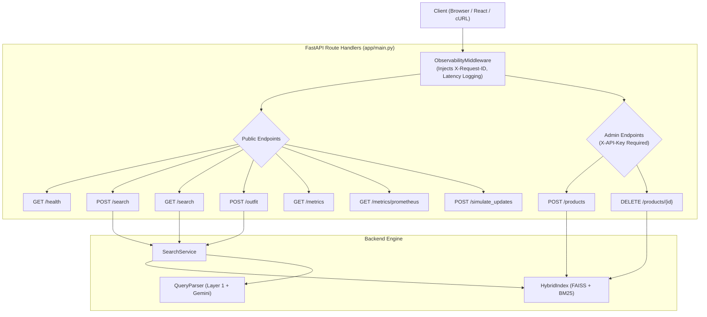

# API Documentation: Semantic Fashion Search & Recommendation System

This document specifies all actively implemented HTTP REST endpoints, request/response schemas, authentication policies, validation boundaries, and error protocols for the **Semantic Fashion Search & Recommendation Microservice**.

---

## 1. API Architecture Diagram



---

## 2. Global Middleware, Protocols & Policies

### 2.1 Request Identification & Logging
Every incoming HTTP request passes through `ObservabilityMiddleware` (`app/main.py`):
- Assigns or adopts an `X-Request-ID` header (UUIDv4).
- The `X-Request-ID` is echoed back in all response headers.
- Emits structured JSON log lines with execution latency, query hash, result counts, and fallback parser flags.

### 2.2 Cross-Origin Resource Sharing (CORS)
- **Development Environment:** The React frontend utilizes Vite's development proxy (`frontend/vite.config.ts`), forwarding `/search`, `/outfit`, `/health`, and `/metrics` to `http://localhost:8000`. This allows browser clients to communicate without cross-origin preflight overhead.
- **Production Environment:** Cross-origin access is managed at the reverse proxy layer (e.g., Nginx / Caddy / API Gateway) or through standard CORS middleware configuration.

### 2.3 Authentication & Authorization
- **Public Endpoints:** `/health`, `/search`, `/outfit`, `/metrics`, `/metrics/prometheus`, and `/simulate_updates` require no credentials.
- **Admin Endpoints:** `/products` (batch ingestion) and `/products/{id}` (soft-delete) require an `X-API-Key` request header. Keys are verified via constant-time hashing (`secrets.compare_digest`).
  - If `ADMIN_API_KEY` is not configured in `.env`, the endpoint returns `503 Service Unavailable` (`detail: "admin_disabled"`).
  - If the header is missing or incorrect, it returns `401 Unauthorized` (`detail: "invalid_api_key"`).

### 2.4 Request Validation & Guardrails
- Implemented strictly with Pydantic v2 schemas (`app/schemas.py`).
- Input search queries are restricted: `1 <= len(query) <= 500`.
- Result depths are bounded: `1 <= top_k <= 50`.
- Batch ingestion sizes are capped: `1 <= len(products) <= 500`.
- Malformed payloads yield `422 Unprocessable Entity` containing field-level diagnostic pointers.

### 2.5 Timeout Behavior & Fault Tolerance
- **LLM Timeout:** External Gemini API calls are strictly bounded by `LLM_TIMEOUT_SECONDS` (default: 3.0s).
- **Circuit Breaker:** The `LLMCircuitBreaker` tracks API health. After 3 consecutive timeouts or immediately upon HTTP 429 (quota exhausted), it trips to `OPEN` for 60 seconds, transparently falling back to Layer-1 deterministic regex parsing. User queries never fail with 500 or timeout errors.
- **Frontend Timeout:** Axios client requests are bounded to 15,000 ms (15s).

---

## 3. Verified API Endpoints

| HTTP Method | Route | Access | Purpose |
|:---|:---|:---:|:---|
| `GET` | `/health` | Public | System liveness, index readiness, and catalog health check |
| `POST` | `/search` | Public | Primary semantic/hybrid search and outfit recommendation |
| `GET` | `/search` | Public | Query parameter alias for search |
| `POST` | `/outfit` | Public | Dedicated coordinated outfit composition endpoint |
| `GET` | `/metrics` | Public | Operational percentiles, cache rates, and rolling counters (JSON) |
| `GET` | `/metrics/prometheus` | Public | Observability metrics in standard Prometheus text format |
| `POST` | `/products` | Admin | Atomic batch ingestion and indexing of raw catalog items |
| `DELETE` | `/products/{id}` | Admin | Soft-delete a product from catalog and search indices |
| `POST` | `/simulate_updates` | Public | Verifies dynamic catalog update capability and index readiness |

---

## 4. Endpoint Specifications

### 4.1 GET /health
Checks microservice liveness, database connectivity, FAISS/BM25 index state, and LLM availability.

- **HTTP Method:** `GET`
- **URL:** `/health`
- **Request Parameters / Body:** None
- **Response Model:** `HealthResponse`
- **Status Codes:** `200 OK`, `500 Internal Server Error`

#### Example Request:
```bash
curl -X GET http://localhost:8000/health
```

#### Example Response (200 OK):
```json
{
  "status": "healthy",
  "index_loaded": true,
  "catalog_reachable": true,
  "llm_status": "ok",
  "index_size": 22063,
  "catalog_size": 22063
}
```

---

### 4.2 POST /search
Executes hybrid semantic retrieval (FAISS dense + BM25 sparse + Reciprocal Rank Fusion + deterministic contract filtering + feature reranking).

- **HTTP Method:** `POST`
- **URL:** `/search`
- **Request Body:** `SearchRequest` (JSON)
  - `query` (`string`, required): Search string, 1 to 500 characters.
  - `top_k` (`integer`, optional): Max results to return, 1 to 50 (default: `10`).
  - `mode` (`string`, optional): `"product"`, `"products"`, or `"outfit"` (default: `"product"`).
- **Response Model:** `SearchResponse` (or `OutfitResponse` if `mode="outfit"`)
- **Status Codes:** `200 OK`, `422 Unprocessable Entity`, `500 Internal Server Error`

#### Example Request:
```bash
curl -X POST http://localhost:8000/search \
  -H "Content-Type: application/json" \
  -d '{
    "query": "red cocktail dress under $50",
    "top_k": 3,
    "mode": "product"
  }'
```

#### Example Response (200 OK):
```json
{
  "results": [
    {
      "product_id": "B09P2YDVQ1",
      "title": "Women Elegant Midi Pencil Dress Ruffle Sleeve Round Neck Bodycon...",
      "price": 28.99,
      "brand": "Kafiloe",
      "image_url": "https://m.media-amazon.com/images/I/41x..._SL1000_.jpg",
      "slot": "full_body",
      "accessory_type": null,
      "gender": "women",
      "age_group": "adult",
      "score": 1.0,
      "similarity": 0.7178,
      "reason": "Matching color: red | Ideal for party"
    }
  ],
  "meta": {
    "parsed_filters": {
      "slot": "full_body",
      "gender": "women",
      "age_group": "adult",
      "colors": ["red"],
      "max_price": 50.0,
      "occasion": "party"
    },
    "used_fallback": false,
    "latency_ms": 118.44,
    "index_version": 2,
    "excluded_by_filters": 6,
    "duplicates_collapsed": 4,
    "low_confidence": false,
    "warnings": [],
    "candidate_pool_size": 50,
    "reranker_latency_ms": 1.2
  },
  "outfit": null,
  "message": null,
  "suggested_queries": null
}
```

---

### 4.3 GET /search
Query parameter alias for executing search via browser address bar or simple HTTP clients.

- **HTTP Method:** `GET`
- **URL:** `/search`
- **Query Parameters:**
  - `query` (`string`, required): Search string.
  - `top_k` (`integer`, optional, default: `10`): Number of results.
  - `mode` (`string`, optional, default: `"product"`): `"product"` or `"outfit"`.
- **Response Model:** `SearchResponse | OutfitResponse`
- **Status Codes:** `200 OK`, `422 Unprocessable Entity`

#### Example Request:
```bash
curl -X GET "http://localhost:8000/search?query=black+shoes+for+women&top_k=5"
```

---

### 4.4 POST /outfit
Dedicated endpoint that composes complete, budget-compliant multi-slot fashion ensembles (`top` + `bottom` + `footwear` + `accessory` or `full_body` + `footwear` + `accessory`) using Progressive Candidate Expansion.

- **HTTP Method:** `POST`
- **URL:** `/outfit`
- **Request Body:** `SearchRequest` (JSON)
  - `query` (`string`, required): Aesthetic or occasion query with optional budget cap.
  - `top_k` (`integer`, optional): Default 10.
- **Response Model:** `OutfitResponse`
- **Status Codes:** `200 OK`, `422 Unprocessable Entity`

#### Example Request:
```bash
curl -X POST http://localhost:8000/outfit \
  -H "Content-Type: application/json" \
  -d '{
    "query": "formal outfit for men under $150",
    "top_k": 3
  }'
```

#### Example Response (200 OK):
```json
{
  "outfit": {
    "items": [
      {
        "product_id": "B07XYZ1234",
        "title": "Men Classic Fit Long Sleeve Dress Shirt",
        "price": 32.50,
        "brand": "Van Heusen",
        "slot": "top",
        "accessory_type": null,
        "gender": "men",
        "age_group": "adult",
        "score": 0.94,
        "similarity": 0.68,
        "reason": "Ideal for formal"
      },
      {
        "product_id": "B08ABC5678",
        "title": "Men Slim Fit Flat Front Dress Pants",
        "price": 44.00,
        "brand": "Dockers",
        "slot": "bottom",
        "accessory_type": null,
        "gender": "men",
        "age_group": "adult",
        "score": 0.91,
        "similarity": 0.65,
        "reason": "Ideal for formal"
      },
      {
        "product_id": "B09DEF9012",
        "title": "Men Oxford Formal Leather Shoes",
        "price": 58.00,
        "brand": "Clarks",
        "slot": "footwear",
        "accessory_type": null,
        "gender": "men",
        "age_group": "adult",
        "score": 0.89,
        "similarity": 0.62,
        "reason": "Ideal for formal"
      }
    ],
    "total_price": 134.50,
    "complete": true,
    "missing_slots": [],
    "template": "top_bottom_footwear"
  },
  "meta": {
    "parsed_filters": {
      "gender": "men",
      "age_group": "adult",
      "max_price": 150.0,
      "occasion": "formal"
    },
    "used_fallback": false,
    "latency_ms": 164.68,
    "index_version": 2,
    "excluded_by_filters": 12,
    "duplicates_collapsed": 2,
    "low_confidence": false,
    "warnings": []
  },
  "message": null,
  "suggested_queries": null
}
```

---

### 4.5 GET /metrics
Returns system operational metrics, p50/p95/p99 latency percentiles, cache hit ratios, and filter statistics in structured JSON.

- **HTTP Method:** `GET`
- **URL:** `/metrics`
- **Request Parameters / Body:** None
- **Response Format:** JSON (`dict[str, Any]`)
- **Status Codes:** `200 OK`

#### Example Request:
```bash
curl -X GET http://localhost:8000/metrics
```

#### Example Response (200 OK):
```json
{
  "requests_by_endpoint": {
    "/search": { "200": 152 },
    "/health": { "200": 48 }
  },
  "search_latency_percentiles_ms": {
    "p50": 119.91,
    "p95": 127.66,
    "p99": 145.20
  },
  "p50": 119.91,
  "p95": 127.66,
  "p99": 145.20,
  "search_count": 152,
  "outfit_count": 18,
  "average_search_latency": 121.4,
  "average_outfit_latency": 165.2,
  "candidate_pool_size": 50.0,
  "filtered_candidate_count": 8.4,
  "reranker_latency": 1.15,
  "reranker_enabled": true,
  "metadata_filter_rate": 16.8,
  "reranker_cache_hit_rate": 0.88,
  "parser_layer1_count": 114,
  "parser_gemini_count": 38,
  "parser_fallback_count": 0,
  "parser_cache_hits": 64,
  "parser_cache_misses": 88,
  "gemini_latency_p50": 1120.0,
  "gemini_latency_p95": 1340.0,
  "parser_latency_p50": 0.28,
  "parser_latency_p95": 0.34,
  "fallback_rate": 0.0,
  "zero_result_rate": 0.0,
  "low_confidence_rate": 0.0,
  "query_cache_hit_rate": 0.72,
  "parse_cache_hit_rate": 0.42,
  "embedding_cache_hit_rate": 0.65,
  "warnings_count": {},
  "llm_status": "ok",
  "index_size": 22063,
  "index_version": 2,
  "catalog_active_size": 22063,
  "ingestion": {
    "accepted_total": 22063,
    "rejected_by_reason": {},
    "last_batch_duration_ms": 0.0
  }
}
```

---

### 4.6 GET /metrics/prometheus
Exposes system operational metrics formatted in Prometheus plain-text exposition format for automated polling by Prometheus scrapers.

- **HTTP Method:** `GET`
- **URL:** `/metrics/prometheus`
- **Request Parameters / Body:** None
- **Response Format:** `text/plain; version=0.0.4; charset=utf-8`
- **Status Codes:** `200 OK`

#### Example Request:
```bash
curl -X GET http://localhost:8000/metrics/prometheus
```

#### Example Response (200 OK):
```text
# HELP fashion_search_index_size Current number of products indexed in memory
# TYPE fashion_search_index_size gauge
fashion_search_index_size 22063
# HELP fashion_search_latency_p50_ms Search latency 50th percentile in ms
# TYPE fashion_search_latency_p50_ms gauge
fashion_search_latency_p50_ms 119.91
# HELP fashion_search_latency_p95_ms Search latency 95th percentile in ms
# TYPE fashion_search_latency_p95_ms gauge
fashion_search_latency_p95_ms 127.66
# HELP fashion_search_total Total search queries executed
# TYPE fashion_search_total counter
fashion_search_total 152
# HELP fashion_search_fallback_rate Percentage of searches using fallback parser
# TYPE fashion_search_fallback_rate gauge
fashion_search_fallback_rate 0.0
# HELP fashion_search_parser_layer1_total Total queries resolved by Layer 1 parser
# TYPE fashion_search_parser_layer1_total counter
fashion_search_parser_layer1_total 114
# HELP fashion_search_parser_gemini_total Total queries parsed by Gemini LLM
# TYPE fashion_search_parser_gemini_total counter
fashion_search_parser_gemini_total 38
```

---

### 4.7 POST /products (Admin)
Atomic batch ingestion endpoint for submitting raw Amazon product metadata records. Cleans titles, extracts attributes, derives vector embeddings, persists records into SQLite, and incrementally updates FAISS and BM25 indices.

- **HTTP Method:** `POST`
- **URL:** `/products`
- **Security:** Requires header `X-API-Key: <ADMIN_API_KEY>`
- **Request Body:** `ProductBatchRequest` (JSON)
  - `products` (`list[object]`, required, 1 to 500 records)
- **Response Model:** `ProductBatchResponse`
- **Status Codes:** `200 OK`, `401 Unauthorized`, `422 Unprocessable Entity`, `503 Service Unavailable`

#### Example Request:
```bash
curl -X POST http://localhost:8000/products \
  -H "X-API-Key: secret-admin-key" \
  -H "Content-Type: application/json" \
  -d '{
    "products": [
      {
        "parent_asin": "B0NEWITEM01",
        "title": "Women Floral Print Summer Boho Maxi Dress",
        "price": 34.99,
        "store": "BohoStyle",
        "average_rating": 4.5,
        "rating_number": 120,
        "features": ["100% Rayon", "V-Neckline", "Short Sleeves"],
        "details": {"Department": "womens"}
      }
    ]
  }'
```

#### Example Response (200 OK):
```json
{
  "accepted_count": 1,
  "rejected_count": 0,
  "index_version": 3,
  "items": [
    {
      "parent_asin": "B0NEWITEM01",
      "status": "created",
      "version": 1,
      "reason": null
    }
  ]
}
```

---

### 4.8 DELETE /products/{id} (Admin)
Soft-deletes a product by ASIN in the SQLite catalog (`is_deleted=1`) and removes it from in-memory search indices without restarting the service.

- **HTTP Method:** `DELETE`
- **URL:** `/products/{id}`
- **Security:** Requires header `X-API-Key: <ADMIN_API_KEY>`
- **Path Parameters:**
  - `id` (`string`, required): Product `parent_asin`
- **Response Model:** `ProductDeleteResponse`
- **Status Codes:** `200 OK`, `401 Unauthorized`, `404 Not Found`, `503 Service Unavailable`

#### Example Request:
```bash
curl -X DELETE http://localhost:8000/products/B0NEWITEM01 \
  -H "X-API-Key: secret-admin-key"
```

#### Example Response (200 OK):
```json
{
  "product_id": "B0NEWITEM01",
  "status": "deleted",
  "index_version": 4
}
```

---

### 4.9 POST /simulate_updates
Verification endpoint that confirms the dynamic catalog update subsystem and atomic rebuilding mechanisms are operational.

- **HTTP Method:** `POST`
- **URL:** `/simulate_updates`
- **Request Parameters / Body:** None
- **Response Format:** JSON
- **Status Codes:** `200 OK`

#### Example Request:
```bash
curl -X POST http://localhost:8000/simulate_updates
```

#### Example Response (200 OK):
```json
{
  "status": "ready",
  "message": "Dynamic catalog update capability active. Rebuild/incremental updates verified.",
  "active_catalog_size": 22063,
  "index_size": 22063,
  "index_version": 2
}
```

---

## 5. Standard Error Handling Protocols

All error responses return structured JSON payloads accompanied by standard HTTP status codes:

### 5.1 Validation Error (HTTP 422)
Occurs when request payloads fail Pydantic constraints (e.g. query length > 500 characters, empty body, negative price).
```json
{
  "error": "validation_error",
  "details": [
    {
      "type": "string_too_long",
      "loc": ["body", "query"],
      "msg": "String should have at most 500 characters",
      "input": "..."
    }
  ]
}
```

### 5.2 Unauthorized Error (HTTP 401)
Occurs when an admin endpoint is called with a missing or invalid `X-API-Key` header.
```json
{
  "detail": "invalid_api_key"
}
```

### 5.3 Admin Service Disabled (HTTP 503)
Occurs when calling `/products` while `ADMIN_API_KEY` is left blank in server configuration.
```json
{
  "detail": "admin_disabled"
}
```

### 5.4 Resource Not Found (HTTP 404)
Occurs when requesting or deleting a non-existent product ASIN.
```json
{
  "error": "not_found",
  "message": "Product 'B0NONEXISTENT' not found in catalog."
}
```

### 5.5 Server Error (HTTP 500)
Occurs if an unhandled internal exception occurs. The client receives a clean error message while the stack trace is recorded in server logs tagged with `X-Request-ID`.
```json
{
  "error": "internal_server_error",
  "message": "An unexpected error occurred."
}
```
