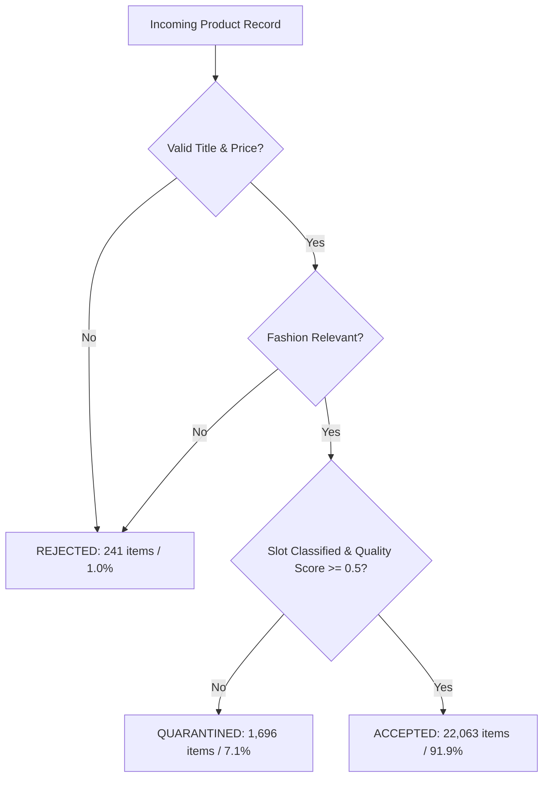
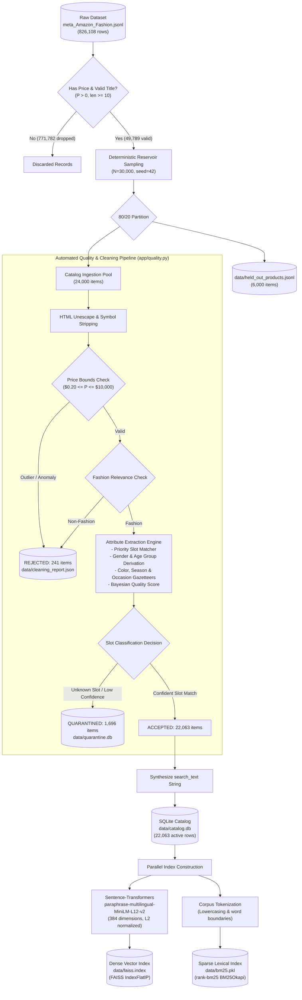

# Dataset Documentation: Semantic Fashion Search & Recommendation System

This document provides a comprehensive, empirically verified reference of the dataset pipeline powering the **Semantic Fashion Search & Recommendation System**. All figures, schemas, regex rules, triage thresholds, and distributions are derived directly from the active catalog database (`data/catalog.db`), audit fixtures, and quality control reports (`data/cleaning_report.json`, `data/ingestion_report.json`).

---

## 1. Dataset Overview

The system is trained, indexed, and evaluated on authentic commercial product listings from the **Amazon Fashion** domain. The dataset captures the multi-faceted challenges of real-world e-commerce catalogs:
- Massive category imbalance (heavy skew toward jewelry and accessories; scarce footwear and bottoms).
- Incomplete metadata (65.2% missing descriptions, 51.9% unextracted colors).
- High vocabulary variation across user search intents and merchant product titles.
- Presence of out-of-domain noise (automotive stickers, musical accessories, medical equipment).

---

## 2. Dataset Source

- **Collection:** **Amazon Reviews 2023** research dataset.
- **Curated By:** McAuley Lab, University of California San Diego (UCSD).
- **Source File:** `meta_Amazon_Fashion.jsonl`.
- **Domain:** Apparel, footwear, jewelry, accessories, and fashion wearables.

---

## 3. Dataset Size

| Stage | Record Count | Percentage | Description / Storage |
|:---|:---:|:---:|:---|
| **Raw Scanned Records** | **826,108** | 100.0% | Uncompressed raw JSONL entries in McAuley dataset |
| *Dropped: Missing Price* | 770,546 | 93.27% | Excluded due to absence of verifiable price |
| *Dropped: Short / Missing Title* | 1,236 | 0.15% | Excluded (title length $< 10$ chars or empty) |
| *Dropped: Non-Fashion Keyword* | 4,537 | 0.55% | Excluded by initial lexical blacklist |
| **Valid Candidate Pool** | **49,789** | 6.03% | Clean candidate records meeting baseline criteria |
| **Reproducible Reservoir Sample** | **30,000** | 100.0% | Deterministically drawn with `RANDOM_SEED=42` |
| **Held-Out Test Set** | **6,000** | 20.0% | Isolated in `data/held_out_products.jsonl` |
| **Catalog Ingestion Pool** | **24,000** | 80.0% | Initial dataset ingested into SQLite |
| **ACCEPTED (Active Search Index)** | **22,063** | **91.93%** | Passed QC into active vector & lexical index |
| **QUARANTINED (Ambiguous Slot)** | **1,696** | **7.07%** | Isolated in `data/quarantine.db` |
| **REJECTED (Anomalies / Corrupt)** | **241** | **1.00%** | Recorded in `data/cleaning_report.json` |

---

## 4. Raw Data Format

Raw listings are formatted as uncompressed, newline-delimited JSON (`JSONL`):

```json
{
  "main_category": "AMAZON FASHION",
  "title": "Long Way Blue Beads Carved Bracelet Sliver Plated Snake Chain Charm Bracelet",
  "average_rating": 4.1,
  "rating_number": 87,
  "features": [
    "Eco-friendly Zinc Alloy with Silver Plated, Lead-Free & Nickle-Free",
    "Fit for any Occasion: Party, Wedding, Anniversary, Engagement"
  ],
  "description": [
    "Gorgeous charm bracelet crafted with vibrant Austrian crystal beads."
  ],
  "price": "14.99",
  "images": [
    {
      "thumb": "https://m.media-amazon.com/images/I/41x..._SS40_.jpg",
      "large": "https://m.media-amazon.com/images/I/41x..._SL1000_.jpg",
      "variant": "MAIN"
    }
  ],
  "store": "LONG WAY",
  "categories": ["Clothing, Shoes & Jewelry", "Women", "Jewelry", "Bracelets"],
  "details": {
    "Department": "womens",
    "Material": "Silver Plated",
    "Metal stamp": "no-metal-stamp"
  },
  "parent_asin": "B00X9U8V7M"
}
```

---

## 5. Product Fields

### Raw Input Schema (`RawProductMetadata` in `app/schemas.py`)
- `parent_asin`: Unique product parent identifier (`str`).
- `title`: Unsanitized product title (`str`).
- `price`: Numeric or string price representation (`float | str | None`).
- `average_rating`: Mean historical star rating $\in [1.0, 5.0]$ (`float | None`).
- `rating_number`: Historical customer review count (`int | None`).
- `features`: Bullet-point feature list (`list[str]`).
- `description`: Text descriptions (`str | list[str] | None`).
- `store`: Brand or seller name (`str | None`).
- `images`: Image object array (`list[dict[str, Any]]`).
- `details`: Merchant key-value dictionary (`dict[str, Any]`).

### Enriched Catalog Schema (`Product` in `app/schemas.py`)
- `id`: Internal integer auto-increment primary key (`int`).
- `product_id`: Maps to `parent_asin` (`str`, indexed, unique).
- `title`: Cleaned, HTML-unescaped title (`str`).
- `brand`: Extracted designer or store name (`str | None`).
- `price`: Normalized numerical price in USD (`float`).
- `slot`: Primary clothing category: `top`, `bottom`, `full_body`, `footwear`, `accessory`, `innerwear`, or `unknown` (`str`).
- `accessory_type`: Fine-grained classification for accessories: `hat`, `eyewear`, `bag`, `scarf`, `belt`, `watch`, `jewelry`, `body_jewelry`, `hair`, `socks`, `gloves`, `other` (`str | None`).
- `gender`: Target demographic: `men`, `women`, `unisex`, `unknown` (`str`).
- `age_group`: Target age: `adult` vs `kids` (`str`).
- `colors`: Extracted canonical color tokens (`list[str]`).
- `seasons`: Applicable seasonal labels (`list[str]`).
- `occasions`: Applicable occasion tags (`list[str]`).
- `quality_score`: Bounded composite quality metric $\in [0.0, 1.0]$ (`float`).
- `search_text`: Synthetic composite string used for BM25 and dense embedding generation (`str`).

---

## 6. Data Validation

Data validation is enforced by `app/quality.py` through multi-signal predicate checks:

1. **Title Integrity:**
   - Must contain $\ge 10$ characters (`min_length=10`).
   - Must contain $\ge 2$ alphanumeric word tokens of length $\ge 2$.
   - Rejects strings dominated by repetitive punctuation (`-----`, `?????`, `.....`).
2. **Price Sanity:**
   - Must parse to a positive IEEE 754 floating-point number.
   - Price floor: $P \ge \$0.20$ (`qc_price_min`).
   - Price ceiling: $P \le \$10,000.00$ (`qc_price_max`).
3. **Domain Relevance:**
   - Evaluates whether product text matches strong out-of-domain regexes while honoring explicit fashion override patterns.

---

## 7. Data Cleaning

1. **HTML Entity Normalization:** `html.unescape()` transforms encoded entities (`&amp;` $\to$ `&`, `&#39;` $\to$ `'`, `&quot;` $\to$ `"`).
2. **Decorative Glyphs Stripping:** Regex removes uninformative marketing unicode symbols (`✔`, `★`, `◆`, `●`, `▲`, `✓`).
3. **Run-Together Whitespace Collapsing:** Multiple whitespace tokens, carriage returns, and tabs are collapsed into single ASCII spaces.
4. **Search Text Synthesis:**
   `search_text` is generated by concatenating:
   ```python
   f"{title} {brand} {slot} {' '.join(colors)} {' '.join(occasions)} {' '.join(seasons)} {' '.join(features[:3])}"
   ```
   This ensures both BM25 and Sentence-Transformers have complete context in a single string.

---

## 8. Product Classification

Products are triaged by the Quality Control pipeline into three explicit tiers:



- **ACCEPTED (22,063 items):** Confident slot classification, valid pricing, clean title. Inserted into active SQLite catalog and indexed by FAISS and BM25.
- **QUARANTINED (1,696 items):** Legitimate fashion items whose specific clothing slot could not be determined with high confidence (`unknown_slot`). Stored in `data/quarantine.db` to prevent degrading search results.
- **REJECTED (241 items):** Corrupted records:
  - Non-fashion hardware/auto parts: 104 items
  - Exact duplicate product titles: 103 items
  - Price outliers ($< \$0.20$ or $> \$10,000$): 33 items
  - Meaningless/garbled title: 1 item

---

## 9. Attribute Extraction

Attributes are extracted using deterministic, priority-ordered regular expressions and gazetteers defined in `app/attributes.py`.

---

## 10. Gender Classification

Gender is determined hierarchically:
1. **Department Metadata Check (Primary):**
   - Matches `details["Department"]` against regex `\b(?:women|womens|girls|girl)\b` vs `\b(?:men|mens|boys|boy)\b`.
   - If both or `unisex` are present $\to$ classified as `unisex`.
2. **Title Regex Fallback (Secondary):**
   - Scans product title for gender-specific boundary tokens (`\bmen'?s?\b`, `\bwomen'?s?\b`).
3. **Default:** Classified as `unknown` if neither department nor title specifies gender.

### Verified Gender Distribution (Accepted Active Catalog $N=22,063$)

| Gender Category | Item Count | Percentage |
|:---|:---:|:---:|
| `unknown` (Gender-neutral / Unstated) | 12,292 | 55.71% |
| `women` | 5,564 | 25.22% |
| `men` | 2,783 | 12.61% |
| `unisex` | 1,424 | 6.45% |

---

## 11. Slot Classification

Slots represent canonical garment positions. Because titles frequently contain compound tokens (e.g., *"shoes to wear with a dress"*), `app/attributes.py` enforces a **strict priority sequence**:

1. `footwear` (sandals, shoes, sneakers, boots, loafers, heels, slippers).
2. `full_body` (dresses [with negative lookahead for dress shirts/shoes], jumpsuits, rompers, swimsuits, pajamas).
3. `top` (phrase heuristics: *"top to wear with jeans"*).
4. `bottom` (pants, shorts, jeans, skirts, leggings, trousers).
5. `innerwear` (bras, panties, boxers, briefs, shapewear).
6. `top` (shirts, t-shirts, hoodies, jackets, coats, cardigans, sweaters).
7. `accessory` (jewelry, watches, hats, bags, belts, scarves, sunglasses, socks).
8. `unknown` (unmatched items routed to quarantine).

### Verified Slot Distribution (Accepted Active Catalog $N=22,063$)

| Clothing Slot | Item Count | Percentage | Catalog Characteristic |
|:---|:---:|:---:|:---|
| `accessory` | 13,541 | 61.37% | High catalog concentration (jewelry, watches, hats) |
| `top` | 3,616 | 16.39% | Shirts, blouses, jackets, hoodies |
| `full_body` | 2,339 | 10.60% | Dresses, rompers, jumpsuits, suits |
| `bottom` | 1,328 | 6.02% | Pants, jeans, skirts, shorts |
| `footwear` | 803 | 3.64% | Shoes, boots, sandals, heels |
| `innerwear` | 436 | 1.98% | Underwear, bras, boxers |

---

## 12. Color Extraction

Colors are identified by matching against a standardized 28-term color gazetteer (`COLOR_VOCABULARY`) with synonym canonicalization:
- **Canonical Colors:** `black`, `white`, `blue`, `red`, `green`, `yellow`, `pink`, `purple`, `orange`, `brown`, `gray`, `beige`, `navy`, `khaki`, `gold`, `silver`, `teal`, `maroon`, `olive`, `burgundy`, `cream`, `tan`, `coral`, `mint`, `turquoise`, `floral`.
- **Synonym Mapping:** `grey` $\to$ `gray`, `flower` / `flowers` $\to$ `floral`.
- **Parenthetical Priority:** Parentheses in titles (e.g., `"(Navy Blue)"`) are extracted and matched first.
- **Coverage:** In the initial 24,000 raw sample, 12,443 items (51.85%) had no explicit color in their title.

---

## 13. Season Extraction

Seasonality is inferred through context keywords:
- `summer`: `summer`, `beach`, `swim`, `sandal`, `tank`, `shorts`, `lightweight`.
- `winter`: `winter`, `fleece`, `thermal`, `wool`, `insulated`, `parka`.
- `spring`: `spring`, `breeze`, `pastel`, `floral`.
- `fall`: `fall`, `autumn`, `flannel`, `trench`.

---

## 14. Occasion Extraction

Occasion tags are derived via contextual keyword mapping:
- `beach`: `beach`, `swim`, `thong`, `flip-flop`.
- `workout`: `compression`, `athletic`, `running`, `workout`, `yoga`.
- `formal`: `dress shirt`, `blazer`, `formal`, `tuxedo`, `suit`.
- `casual`: `casual`, `everyday`, `loungewear`, `lounge`.
- `party`: `party`, `cocktail`, `evening`.
- `travel`: `travel`, `packable`.

---

## 15. Price Validation

- Raw prices are cast to 2-decimal floats.
- Outliers ($< \$0.20$ or $> \$10,000.00$) are permanently rejected (33 items documented in `cleaning_report.json`).
- Items missing price data during ingestion ($770,546$ raw records / $93.27\%$) were discarded prior to reservoir sampling to ensure that all catalog items support budget queries.
- Catalog statistics: Minimum price \$0.20, maximum price \$9,999.00, mean price \$40.96.

---

## 16. Duplicate Handling

1. **Ingestion Deduplication:** Exactly identical product titles and ASINs are filtered out during cleaning (103 duplicates rejected).
2. **Search Runtime Deduplication:**
   - Multi-variant listings (e.g., same brand and clothing item in different pack sizes or colors) frequently monopolize top-$k$ results.
   - `passes_strict_filters()` groups candidates by brand and calculates title token Jaccard similarity.
   - Pairs with Jaccard $\ge 0.85$ are collapsed, retaining only the highest-scoring variant while reporting the count of collapsed duplicates in response metadata (`duplicates_collapsed`).

---

## 17. Unknown / Unclassified Product Handling

Items that fail confident slot extraction are handled through two layers:

1. **Offline Quarantine (`data/quarantine.db`):**
   - Products with `slot == "unknown"` or low classification confidence are excluded from `data/catalog.db` and placed in `quarantine.db`.
   - This ensures the active FAISS and BM25 indices contain zero unclassified items, preventing index pollution.
2. **Runtime Search Eligibility Guard (`app/attribute_correction.py`):**
   - If an unclassified item enters candidate evaluation, `is_search_eligible_product()` inspects its text against `PERIPHERAL_NOISE_PATTERN` (car decals, zipper pulls, replacement buttons, CPR training masks).
   - Peripheral noise is suppressed from generic fashion searches.
   - **Query Exemption:** If a shopper explicitly searches for a peripheral item (e.g., *"replacement zipper pull"* or *"shoe charm"*), the guard exempts the item and allows it to appear in results.

---

## 18. SQLite Catalog

- **File:** `data/catalog.db` (Size: ~88.9 MB).
- **Table:** `products` (22,063 active rows).
- **Mode:** Write-Ahead Logging (`PRAGMA journal_mode=WAL;`).
- **Integrity Checksum:** SHA-256 `1e70fb6a94bd84f905f19437a022111d14889505cd06ae87687b1c11829d6c42`.
- **Capabilities:** Supports atomic transactions, soft deletes (`is_active` flag), and version-increment triggers (`index_version`).

---

## 19. FAISS Index

- **File:** `data/faiss.index`.
- **Index Type:** FAISS `IndexFlatIP` (Exact Maximum Inner Product Search).
- **Vectors:** Exactly 22,063 normalized vectors of dimension $d = 384$.
- **Embedding Model:** `sentence-transformers/paraphrase-multilingual-MiniLM-L12-v2`.
- **Memory Footprint:** $\approx 33.9\text{ MB}$ uncompressed in RAM.
- **Query Latency:** $< 2.0\text{ ms}$ for $k=50$.

---

## 20. BM25 Index

- **File:** `data/bm25.pkl`.
- **Algorithm:** BM25Okapi ($k_1 = 1.5, b = 0.75$).
- **Corpus Size:** 22,063 tokenized document texts.
- **Vocabulary:** English lowercased alphanumeric tokens extracted from `search_text`.
- **Query Latency:** $< 3.0\text{ ms}$ for $k=50$.

---

## 21. Data Quality Issues

| Issue Observed in Raw Data | Real-World Impact | Pipeline Resolution | Status |
|:---|:---|:---|:---:|
| **93.27% Missing Prices** | E-commerce items without prices break budget filters | Filtered out during dataset preprocessing | Verified |
| **Severe Category Asymmetry** | Accessories represent 61.4% of catalog; Footwear is only 3.6% | Progressive Candidate Expansion ($k=50 \to 400$) | Verified |
| **Run-together Brand Titles** | Merchant titles contain unspaced tokens and HTML junk | `clean_text()` and `html.unescape()` | Verified |
| **Peripheral Non-Fashion Noise** | Car decals, guitar straps, CPR training masks in fashion category | Quality Gate rejection + Search Eligibility Guard | Verified |
| **Costume Jewelry Slot Collision** | "Costume" keyword routed jewelry into `full_body` | Contextual slot override in `attribute_correction.py` | Verified |
| **Jackets with "Short" Sizing** | Jacket titles with "Short" size classified as `bottom` | Contextual jacket override in `attribute_correction.py` | Verified |

---

## 22. Current Limitations & Potential Improvements

### Current Limitations
1. **Zero Raw Review Text:** The McAuley metadata subset omitted raw customer review bodies (`with_review_snippets: 0.0%`). Bayesian quality scores rely on star ratings and review counts rather than sentiment analysis of review bodies.
2. **Missing Product Descriptions:** 65.19% of products have empty description fields, requiring attribute derivation to rely primarily on titles and bullet features.
3. **Missing Color Metadata:** 51.85% of listings do not specify a recognizable color in their title, defaulting to unconstrained color matching.

### Potential Future Improvements (Not Implemented)
- *Vision-Language Multimodal Slot Tagging:* Extracting missing colors and garment silhouettes directly from product image thumbnails using CLIP or SigLIP.
- *LLM-Assisted Quarantine Recovery:* Running a batch offline LLM task over the 1,696 quarantined records in `quarantine.db` to classify ambiguous slots and reintroduce valid products into the active catalog.
- *Real-time CDC Ingestion:* Replacing manual batch re-indexing with an Apache Kafka event stream and vector databaseupserts.

---

## 23. Data Processing Workflow


