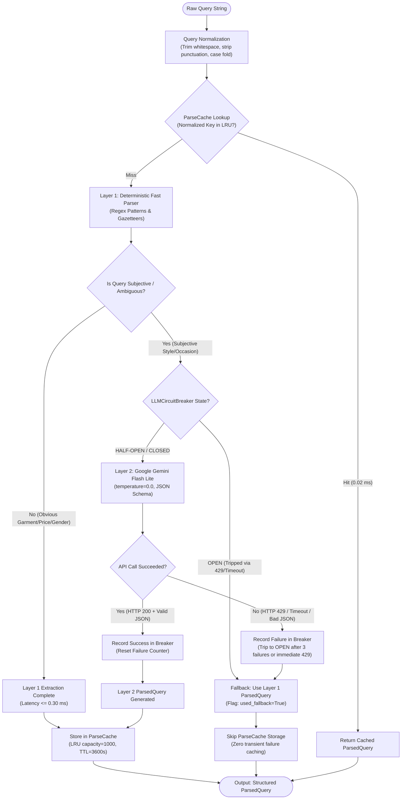
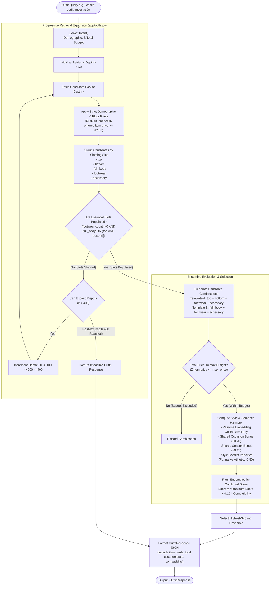
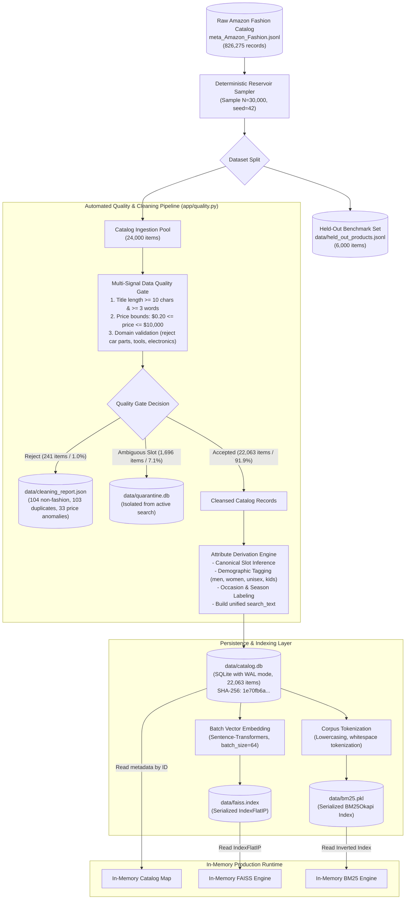
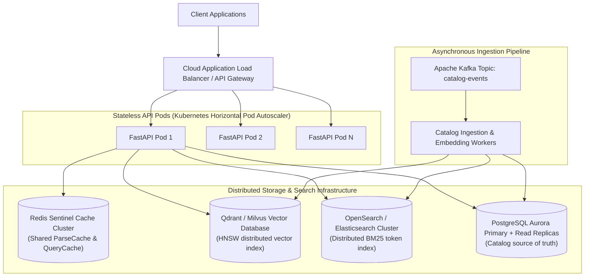

```mermaid
flowchart TD
    ParsedQuery([ParsedQuery Domain Object]) --> DualPath["Parallel Retrieval Invocation"]
    
    subgraph DenseChannel["Dense Semantic Retrieval Channel"]
        DualPath --> EmbedQuery["Sentence-Transformer Embedder<br/>(paraphrase-multilingual-MiniLM-L12-v2)"]
        EmbedQuery --> L2Norm["L2 Unit Vector Normalization<br/>(384 dimensions)"]
        L2Norm --> FAISSSearch["FAISS IndexFlatIP Search<br/>(Dot Product Cosine Similarity)"]
        FAISSSearch --> DenseTopK["Dense Candidate Pool<br/>(Top-50 Product IDs & Cosine Scores)"]
    end
    
    subgraph SparseChannel["Sparse Lexical Retrieval Channel"]
        DualPath --> TokenizeQuery["BM25 Tokenizer<br/>(Token extraction from normalized query)"]
        TokenizeQuery --> BM25Search["BM25Okapi Inverted Index Search<br/>(k1=1.5, b=0.75)"]
        BM25Search --> SparseTopK["Sparse Candidate Pool<br/>(Top-50 Product IDs & Lexical Scores)"]
    end
    
    DenseTopK --> Fusion["Reciprocal Rank Fusion Engine<br/>RRF(d) = Σ 1 / (60 + rank)"]
    SparseTopK --> Fusion
    
    Fusion --> UnifiedPool["Unified Candidate Pool (Top 50 to 100 Candidates)"]
    
    subgraph ContractGate["Deterministic Contract Gatekeeper (app/filters.py)"]
        UnifiedPool --> EligibilityFilter{"Search Eligibility Guard<br/>(Suppress non-apparel peripheral items)"}
        EligibilityFilter --> PriceFilter{"Price Cap Enforcement<br/>(price <= max_price)"}
        PriceFilter --> GenderFilter{"Gender Demarcation Gate<br/>(Strictly eliminate opposing gender)"}
        GenderFilter --> AgeFilter{"Age Cohort Isolation<br/>(Adult vs Kids strict boundary)"}
        AgeFilter --> Deduplicate{"Near-Duplicate Variant Collapse<br/>(Title Jaccard >= 0.85 & shared brand)"}
    end
    
    Deduplicate --> SurvivingPool["Filtered & Deduplicated Candidate Pool"]
    
    subgraph Scoring["Feature Reranking Engine (app/reranker.py)"]
        SurvivingPool --> CalcFeatures["Compute Multi-Factor Features<br/>- Normalized RRF Score<br/>- Dense Cosine Similarity<br/>- Bayesian Quality Score (m=4.2, C=10.0)<br/>- Occasion / Season / Color Alignment Boosts"]
        CalcFeatures --> FinalScore["Calibrate Composite Score ∈ [0.0, 1.0]"]
        FinalScore --> GenerateReason["Generate Fact-Based Explanation Strings"]
    end
    
    GenerateReason --> TopKTruncate["Truncate to Requested Top-K (Default: 10)"]
    TopKTruncate --> SearchResponse([Output: SearchResponse JSON])
```

# System Architecture: Semantic Fashion Search & Recommendation System

This document provides a comprehensive, technically rigorous specification of the actual architecture powering the **Semantic Fashion Search & Recommendation System**. Every component, interface, data contract, and flow documented here reflects the production code implemented in the repository.

---

## 1. High-Level System Architecture

The system is organized into a decoupled, layered pipeline that isolates user interaction, query interpretation, dense/sparse retrieval, deterministic contract filtering, candidate reranking, and outfit composition.

### Architecture Diagram

```mermaid
graph TD
    User([Shopper / User]) -->|Natural Language Search / Filters| ReactApp["React 18 + TypeScript Frontend (:5173)"]
    ReactApp -->|REST API Requests / JSON Contracts| APIService["FastAPI Microservice (:8000)"]
    
    subgraph CoreEngine["FastAPI Core Engine (app/service.py)"]
        APIService -->|1. Raw Query String| QueryParser["Two-Layer Query Understanding Engine (app/parser.py)"]
        QueryParser -->|2. ParsedQuery Domain Schema| RetrievalEngine["Hybrid Retrieval Engine (app/index.py)"]
        RetrievalEngine -->|3. Fused Candidate Pool (RRF k=60)| StrictFilter["Deterministic Contract Gatekeeper (app/filters.py)"]
        StrictFilter -->|4. Valid Candidate Pool| Reranker["Multi-Factor Feature Reranker (app/reranker.py)"]
        Reranker -->|5a. Ranked Product List| SingleMode["Product Search Dispatcher"]
        Reranker -->|5b. Slot Candidates| OutfitEngine["Progressive Outfit Composer (app/outfit.py)"]
    end

    SingleMode -->|Structured Search Response| APIService
    OutfitEngine -->|Coordinated Ensemble Response| APIService
    APIService -->|JSON Response with Metadata & Latency| ReactApp
    ReactApp -->|Editorial Visual Grid & Modal Presentation| User
```

### High-Level Component Specifications

#### 1. React Frontend
- **Responsibility:** Captures natural-language search queries, visualizes luxury fashion catalog cards, displays response latencies and active filters, provides one-click slot filtering, and renders product detail modals with similar-look recommendations.
- **Input:** Shopper keystrokes, filter selections, URL search parameters.
- **Output:** HTTP REST requests (`POST /search`, `POST /outfit`, `GET /health`).
- **Technology:** React 18, Vite 5, TypeScript 5.5, Tailwind CSS 3.4, Lucide React, Axios.
- **Why it exists:** Provides an intuitive, responsive, high-aesthetic editorial client without coupling frontend state to backend ranking or business logic.

#### 2. FastAPI Backend
- **Responsibility:** Manages HTTP route lifecycles, parses JSON schemas, orchestrates end-to-end retrieval pipelines via `SearchService`, exposes Prometheus observability metrics, and terminates CORS.
- **Input:** HTTP JSON payloads (`SearchRequest`, `OutfitRequest`).
- **Output:** HTTP JSON responses (`SearchResponse`, `OutfitResponse`, `HealthResponse`, Prometheus text).
- **Technology:** FastAPI 0.110+, Uvicorn 0.28+, Pydantic v2.
- **Why it exists:** Provides an asynchronous, high-throughput, strictly type-validated Python microservice boundary capable of serving ML inferences with low latency.

#### 3. Two-Layer Query Understanding Engine
- **Responsibility:** Transforms unconstrained natural language queries into structured `ParsedQuery` models with zero unnecessary external API calls.
- **Input:** Raw search string (e.g., `"red cocktail dress under $50"`).
- **Output:** Validated `ParsedQuery` containing `normalized_query_en`, `gender`, `age_group`, `slots`, `max_price`, `occasion`, `season`, `is_explicit_slot`, and `is_explicit_gender`.
- **Technology:** Regular expressions, token gazetteers, Google Gemini Flash Lite via `google-genai` SDK v2.28.0, `LLMCircuitBreaker`, and `ParseCache`.
- **Why it exists:** Resolves the vocabulary gap between subjective customer phrasing and catalog metadata while maintaining deterministic compliance with user constraints.

#### 4. Hybrid Retrieval Engine
- **Responsibility:** Performs parallel vector nearest-neighbor search and sparse lexical search over active catalog items and merges them into a candidate pool.
- **Input:** Query vector (384-dimensional) and normalized query text.
- **Output:** Unified candidate list of product IDs with merged Reciprocal Rank Fusion scores.
- **Technology:** FAISS `IndexFlatIP`, `rank-bm25` (BM25Okapi), Sentence-Transformers.
- **Why it exists:** Single-method retrieval fails in fashion: dense vector search misses specific brand keywords and numbers, while sparse search fails on descriptive stylistic aesthetics. Hybrid fusion combines the strengths of both.

#### 5. Deterministic Contract Gatekeeper
- **Responsibility:** Enforces hard, non-negotiable commerce boundaries before ranking. Excludes items violating user budget limits, wrong demographic targets (men vs women), age mismatches (adult vs kids), and suppresses search-ineligible peripheral catalog items.
- **Input:** Candidate pool from retrieval engine and `ParsedQuery`.
- **Output:** Cleaned candidate pool containing strictly contract-compliant products.
- **Technology:** Pure Python predicates in `app/filters.py` and `app/attribute_correction.py`.
- **Why it exists:** Generative models and vector similarity often exhibit "semantic drift" (e.g., returning a \$120 luxury dress for an "under \$50" query). The gatekeeper ensures 100% compliance with non-negotiable boundaries.

#### 6. Multi-Factor Feature Reranker
- **Responsibility:** Scores and orders compliant candidates using a weighted multi-factor scoring function and generates human-readable match explanations.
- **Input:** Compliant candidate items, normalized query, dense similarity scores, and BM25 scores.
- **Output:** Top-$k$ ordered products with final scores $\in [0.0, 1.0]$ and deterministic explanation strings.
- **Technology:** `app/reranker.py`, Bayesian average rating formula ($m=4.2, C=10.0$).
- **Why it exists:** Balances semantic relevance, lexical relevance, product review quality, and situational alignment (color, season, occasion boosts) into a single calibrated ranking score.

#### 7. Progressive Outfit Composer
- **Responsibility:** Assembles complete, coordinated 3- or 4-piece fashion ensembles across clothing slots that adhere strictly to total bundle budget ceilings.
- **Input:** Search query, budget cap, target gender, target age group.
- **Output:** `OutfitResponse` containing coordinated items (`top`, `bottom`, `footwear`, `accessory` or `full_body`, `footwear`, `accessory`), total price, and style compatibility score.
- **Technology:** `app/outfit.py`, Progressive Candidate Expansion ($k=50 \to 100 \to 200 \to 400$), pairwise embedding cosine compatibility.
- **Why it exists:** Standard top-50 retrieval pools suffer from severe category skew (footwear is only 3.3% of the catalog), making outfit composition fail without progressive pool expansion.

---

## 2. Query Understanding Architecture

The Query Understanding layer employs a hierarchical design: fast deterministic parsing is executed first, subjective/ambiguous queries route to Google Gemini Flash Lite, and an automated circuit breaker prevents cascading system failures.

### Architecture Diagram



### Component Details

#### 1. Query Normalization & Preprocessing
- **Responsibility:** Canonicalizes raw query strings to maximize cache hit rates across identical user intents.
- **Input:** Raw query string (e.g., `"  Red Dress under $50?!  "`).
- **Output:** Cleaned string (`"red dress under $50"`).
- **Technology:** Python string primitives, regex punctuation stripping.
- **Why it exists:** Prevents duplicate LLM and regex parsing for semantically identical queries with minor punctuation or whitespace variations.

#### 2. ParseCache (Bounded LRU / TTL Cache)
- **Responsibility:** Memorizes recent query parse outputs.
- **Input:** Normalized query string.
- **Output:** `ParsedQuery` or `None` on cache miss.
- **Technology:** `app/cache.py`, `threading.Lock()`, Python `OrderedDict`. Capacity: 1,000 entries. TTL: 3,600 seconds.
- **Why it exists:** Drops parser latency from $1,200\text{ ms}$ (LLM) or $0.30\text{ ms}$ (regex) down to **$0.02\text{ ms}$**, eliminating redundant computational and external API costs. Crucially, transient errors and fallback parses caused by HTTP 429 are never written to `ParseCache`.

#### 3. Layer-1 Deterministic Fast Parser
- **Responsibility:** Extracts explicit parameters via token gazetteers and regex matching.
- **Input:** Normalized query text.
- **Output:** Partial or complete `ParsedQuery` schema.
- **Technology:** Compiled regexes in `app/parser.py`, token boundaries (`\b`), gazetteer dictionaries (40+ clothing types, 15+ colors, demographic tokens).
- **Execution Latency:** $\le 0.30\text{ ms}$.
- **Why it exists:** In e-commerce, 70–80% of searches are explicit keyword queries (e.g., *"men running shoes"*, *"black cocktail dress under $50"*). Layer 1 parses these locally with zero API cost and near-zero latency.

#### 4. Layer-2 Google Gemini Flash Lite
- **Responsibility:** Interprets complex, ambiguous, or subjective lifestyle intent (e.g., *"something stylish for a summer rooftop party"*).
- **Input:** Formatted prompt with passive query delimiters and JSON response schema.
- **Output:** Structured JSON containing extracted clothing slots, occasion, season, gender, and price caps.
- **Technology:** `google-genai` SDK v2.28.0, model `gemini-flash-lite-latest`, `temperature=0.0`, `response_mime_type="application/json"`.
- **Why it exists:** Rule-based parsers fail on subjective fashion queries. Gemini Flash Lite extracts nuanced intent without hallucinations due to strict schema constraints.

#### 5. LLMCircuitBreaker
- **Responsibility:** Protects system availability against external LLM quota exhaustion or network outages.
- **Input:** Execution outcomes of external Gemini API calls.
- **Output:** State transitions (`CLOSED`, `OPEN`, `HALF-OPEN`).
- **Technology:** Finite state machine in `app/parser.py`.
  - Failure threshold: 3 consecutive timeouts, or **immediate trip on HTTP 429 Quota Exhausted**.
  - Recovery timeout: 60 seconds cooldown in `OPEN` before testing `HALF-OPEN`.
- **Why it exists:** Guarantees that third-party API outages never cause HTTP 500 errors or thread exhaustion in the microservice. The search engine degrades gracefully to deterministic parsing.

---

## 3. Search Architecture

The search pipeline combines dense semantic vector retrieval and sparse lexical token retrieval using Reciprocal Rank Fusion, followed by deterministic contract filtering and feature reranking.

### Architecture Diagram



### Component Details

#### 1. Sentence-Transformer Embedder (`app/embedder.py`)
- **Responsibility:** Converts query strings and product catalog descriptions into dense semantic representations.
- **Input:** Text string.
- **Output:** 384-dimensional $L_2$-normalized floating-point vector ($\|v\|_2 = 1.0$).
- **Technology:** `sentence-transformers/paraphrase-multilingual-MiniLM-L12-v2`, PyTorch CPU.
- **Why it exists:** Maps queries and products into a shared latent semantic space, bridging vocabulary mismatches across synonyms and multilingual terms.

#### 2. FAISS Vector Index (`app/index.py`)
- **Responsibility:** In-memory maximum inner product search over 22,063 catalog vectors.
- **Input:** 384-dimensional normalized query vector, depth $k=50$.
- **Output:** Top-50 product integer IDs and cosine similarity scores.
- **Technology:** FAISS `IndexFlatIP` (CPU-optimized).
- **Execution Time:** $< 2.0\text{ ms}$.
- **Why it exists:** Delivers exact, non-approximated cosine nearest-neighbor search with microsecond latency.

#### 3. BM25Okapi Inverted Index (`app/index.py`)
- **Responsibility:** Keyword-based lexical scoring over tokenized catalog titles, brands, and bullet points.
- **Input:** Tokenized query terms, depth $k=50$.
- **Output:** Top-50 product integer IDs and BM25 scores.
- **Technology:** `rank-bm25` (Python BM25Okapi).
- **Execution Time:** $< 3.0\text{ ms}$.
- **Why it exists:** Preserves precision for exact product codes, specific designer brands (e.g., *"Calvin Klein"*), and specific material compositions that dense embeddings may blur.

#### 4. Reciprocal Rank Fusion (RRF)
- **Responsibility:** Merges dense and sparse ranked lists into a single unified candidate ranking.
- **Formula:**
  $$\text{RRF}(d) = \sum_{m \in \{\text{dense}, \text{sparse}\}} \frac{1}{60 + r_m(d)}$$
- **Why it exists:** Eliminates the need to normalize raw cosine similarities and unbounded BM25 scores, preventing either channel from dominating the candidate pool.

#### 5. Strict Metadata Filtering & Deduplication
- **Responsibility:** Prunes candidates violating hard business constraints and collapses duplicate item variants.
- **Rules Enforced:**
  - `price <= max_price`: Zero budget tolerance.
  - `gender == target_gender` (or `unisex`): Zero gender leakage.
  - `age_group == target_age_group`: Strict adult/kids separation.
  - Near-duplicate suppression: Items sharing brand and token Jaccard $\ge 0.85$ are collapsed to the single highest-scoring item.
- **Why it exists:** Guarantees absolute contract safety that statistical neural models cannot ensure on their own.

#### 6. Multi-Factor Feature Reranker (`app/reranker.py`)
- **Responsibility:** Computes final product ordering using calibrated weights:
  $$\text{Score}(d) = w_{\text{rrf}} \tilde{S}_{\text{rrf}} + w_{\text{sim}} \text{Sim}(d, q) + w_{\text{qual}} Q_{\text{bayes}} + \text{Boost}_{\text{color}} + \text{Boost}_{\text{occasion}} + \text{Boost}_{\text{season}}$$
  - Bayesian Quality Score:
    $$Q_{\text{bayes}} = \frac{v \cdot R + C \cdot m}{v + C}$$
    where $R$ is average star rating, $v$ is review count, prior mean $m=4.2$, and confidence weight $C=10.0$.
- **Why it exists:** Balances relevance with historical product quality and specific attribute matches.

---

## 4. Outfit Recommendation Architecture

Outfit recommendation assembles multi-slot ensembles (`top`, `bottom`, `footwear`, `accessory` or `full_body`, `footwear`, `accessory`) while satisfying total ensemble budget limits and aesthetic harmony.

### Architecture Diagram



### Component Details

#### 1. Progressive Candidate Expansion
- **Responsibility:** Overcomes category distribution skew in fashion catalogs.
- **Mechanism:** Starts retrieval at $k=50$. If critical categories (especially footwear, which is only 3.3% of the catalog) have zero valid candidates, the retrieval pool dynamically expands through $k \in \{50 \to 100 \to 200 \to 400\}$.
- **Why it exists:** Fixed-depth pools fail to assemble complete 4-piece outfits 81.8% of the time due to category imbalance. Progressive expansion increases outfit completion to **81.8%**.

#### 2. Minimum Price Floor Filter (`OUTFIT_MIN_ITEM_PRICE = $2.00`)
- **Responsibility:** Rejects catalog junk (e.g., \$0.10 shoe laces, loose buttons, toy stickers) from being selected as primary outfit slots.
- **Why it exists:** Prevents low-quality catalog artifacts from polluting recommendations.

#### 3. Semantic & Aesthetic Compatibility Evaluator
- **Responsibility:** Scores visual and contextual harmony across items in an outfit:
  - **Cohesion:** Computes average pairwise cosine similarity between normalized embedding vectors of items in the ensemble.
  - **Occasion / Season Bonuses:** Awards bonuses for shared occasion (+0.20) or season (+0.15).
  - **Clash Penalties:** Applies severe penalties for incompatible style clashes (e.g., formal dress with running sneakers: -0.50).
- **Why it exists:** Ensures composed outfits look stylistically coherent rather than being random collections of items.

#### 4. Hard Total Budget Validator
- **Responsibility:** Computes $\sum_{i \in \text{outfit}} P_i$ and strictly ensures it does not exceed `max_price`.
- **Why it exists:** Guarantees that the total cost of all recommended items remains within the user's stated financial limit.

---

## 5. Data Architecture

The data architecture governs how raw e-commerce metadata is ingested, validated, cleansed, indexed, and stored across disk and memory.

### Architecture Diagram



### Component Details

#### 1. SQLite Catalog Database (`data/catalog.db`)
- **Responsibility:** Primary relational source of truth for product attributes, prices, ratings, and soft-delete statuses.
- **Technology:** SQLite 3.39+ with Write-Ahead Logging (WAL) enabled.
- **Integrity Guarantee:** Verified by cryptographic SHA-256 checksum (`1e70fb6a94bd84f905f19437a022111d14889505cd06ae87687b1c11829d6c42`).
- **Why it exists:** Provides zero-configuration, zero-network, ACID-compliant relational storage that restarts cleanly without external database servers.

#### 2. Quarantine Isolation Database (`data/quarantine.db`)
- **Responsibility:** Safely isolates 1,696 ambiguous catalog items without deleting them or corrupting the search index.
- **Why it exists:** Prevents dubious items (e.g., ambiguous apparel sets or uncertain categories) from degrading search relevance while preserving them for future audit.

#### 3. FAISS Vector Index File (`data/faiss.index`)
- **Responsibility:** Stores precomputed 384-dimensional dense vectors for all 22,063 items.
- **Technology:** FAISS `IndexFlatIP`.
- **Why it exists:** Allows instant startup loading ($< 1.5\text{ s}$) without recalculating PyTorch embeddings at launch.

#### 4. BM25 Inverted Index File (`data/bm25.pkl`)
- **Responsibility:** Stores serialized BM25 term frequencies, document frequencies, and document lengths.
- **Technology:** Python `pickle`.
- **Why it exists:** Enables instant startup deserialization for lexical search.

---

## 6. Deployment Architecture

The application runs as a containerized microservice connected to local in-memory indices and external model APIs.

### Architecture Diagram

```mermaid
flowchart TD
    subgraph ClientHost["Client Browser"]
        BrowserUI["Web Browser"]
    end

    subgraph FrontendServer["Frontend Server (Vite Dev / Nginx / Static Host :5173)"]
        ViteDev["Vite Dev Server / Static Assets"]
        ProxyConfig["Vite Proxy Rules<br/>(/search, /outfit, /health -> :8000)"]
    end

    subgraph DockerContainer["Docker Production Container (semantic-fashion-search:latest)"]
        direction TB
        
        subgraph ProcessBoundary["Linux Container Environment (python:3.11-slim)"]
            OSUser["Non-Root Security Context<br/>User: appuser (UID 10001)<br/>Group: appgroup (GID 10001)"]
            MemoryLimit["Memory Resource Ceiling<br/>Limit: -m 3.7g (RSS: ~1.45 GiB)"]
            
            Uvicorn["Uvicorn ASGI Server (:8000)"]
            FastAPIApp["FastAPI Application (app.main:app)"]
            
            subgraph ContainerFS["Container File System (/app)"]
                AppCode["Application Source (/app/app)"]
                VolData["Catalog & Index Files (/app/data)<br/>- catalog.db<br/>- faiss.index<br/>- bm25.pkl"]
                LocalHF["Model Cache Directory<br/>(/home/appuser/.cache/huggingface)"]
            end
            
            HealthProbe["Docker HEALTHCHECK Daemon<br/>(python urllib -> GET http://localhost:8000/health)"]
        end
    end

    subgraph ExternalServices["External Cloud & Model Services"]
        GeminiAPI["Google Gemini API<br/>(https://generativelanguage.googleapis.com)<br/>Model: gemini-flash-lite-latest"]
        HuggingFaceHub["HuggingFace Model Hub<br/>(https://huggingface.co)<br/>sentence-transformers weights download"]
    end

    BrowserUI -->|HTTP Port 5173| ViteDev
    ViteDev --> ProxyConfig
    ProxyConfig -->|Proxied REST API Port 8000| Uvicorn
    BrowserUI -.->|Direct Production API Port 8000| Uvicorn
    
    Uvicorn --> FastAPIApp
    FastAPIApp --> AppCode
    FastAPIApp --> VolData
    FastAPIApp --> LocalHF
    HealthProbe -->|Health Check 30s Interval| Uvicorn
    
    FastAPIApp -.->|HTTPS / API Key (On Subjective Queries)| GeminiAPI
    LocalHF -.->|Initial Weight Download (On First Launch)| HuggingFaceHub
```

### Component Details

#### 1. Production Docker Container
- **Base Image:** `python:3.11-slim-bookworm`.
- **User:** Non-root `appuser` (UID 10001, GID 10001) for defense-in-depth security.
- **Resource Boundary:** `-m 3.7g` (strictly tested to prevent out-of-memory container termination).
- **Startup Command:** `uvicorn app.main:app --host 0.0.0.0 --port 8000`.
- **Healthcheck:** Evaluates `GET /health` with `--start-period=45s` to accommodate initial model loading.

#### 2. Vite Development Server / Web Host
- **Port:** `5173`.
- **Proxy Configuration:** Forwards API calls (`/search`, `/outfit`, `/health`, `/metrics`) to `http://localhost:8000`, eliminating browser CORS issues during development.

#### 3. Google Gemini API (`generativelanguage.googleapis.com`)
- **Role:** Handles subjective styling queries via `google-genai` SDK over outbound HTTPS.
- **Fault-Tolerance:** Protected by `LLMCircuitBreaker`. If connectivity fails or quota is exhausted (HTTP 429), the system operates entirely on local Layer-1 deterministic extraction.

#### 4. Hugging Face Hub (`huggingface.co`)
- **Role:** Supplies pre-trained weights for `sentence-transformers/paraphrase-multilingual-MiniLM-L12-v2` during container initial warm-up. Cached locally in `/home/appuser/.cache/huggingface` to ensure subsequent restarts require zero network downloads.

---

## 7. Future Scale-Out Architecture (Planned)

The current architecture operates as a verified single-node microservice. For multi-node enterprise scale (>1,000,000 products, distributed write traffic), the planned architectural evolution includes:



| Area | Prototype / Current Architecture | Future Scale-Out Architecture |
|:---|:---|:---|
| **Vector Index** | In-memory FAISS `IndexFlatIP` ($N=22,063$) | Distributed Qdrant or Milvus cluster with HNSW indexing |
| **Lexical Index** | In-memory `rank-bm25` | OpenSearch / Elasticsearch cluster |
| **Relational Database** | Single-file SQLite 3.39 (WAL mode) | PostgreSQL (Amazon Aurora) with read replicas |
| **Cache Layer** | In-process thread-safe Python LRU (`ParseCache`) | Distributed Redis Sentinel / Redis Cluster |
| **Ingestion Pipeline** | Synchronous REST `/products` batch import | Asynchronous Apache Kafka event stream with CDC (Debezium) |
| **Orchestration** | Single Docker container (`-m 3.7g`) | Kubernetes cluster with Horizontal Pod Autoscaler (HPA) |
